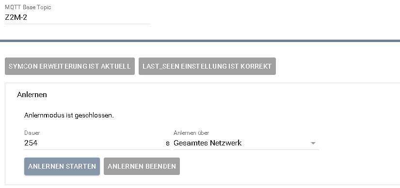
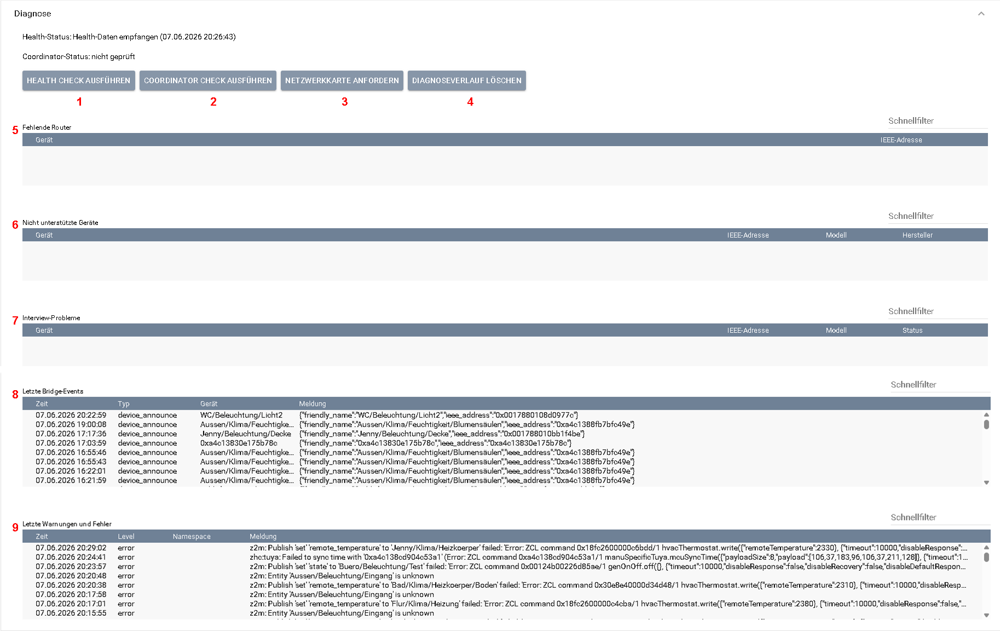
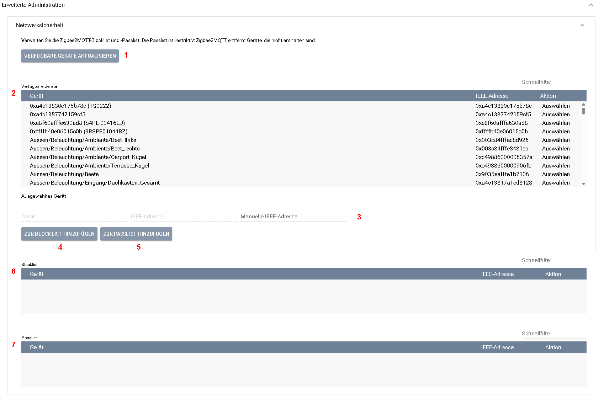
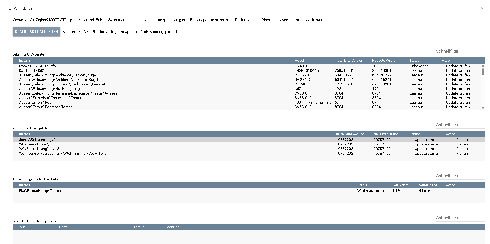
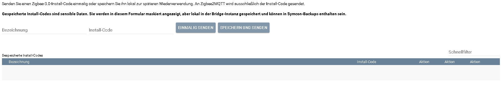
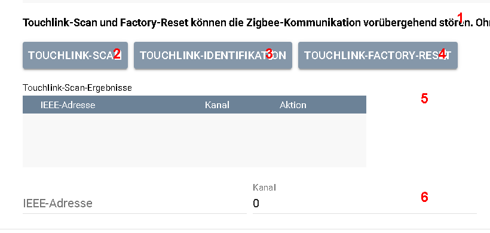

[](https://www.symcon.de/service/dokumentation/entwicklerbereich/sdk-tools/sdk-php/)
[](https://community.symcon.de/t/modul-zigbee2mqtt-version-5-x/139819)
[](https://www.symcon.de/de/service/dokumentation/einfuehrung/systemvoraussetzungen/versionenuebersicht/#version-90)
[](https://creativecommons.org/licenses/by-nc-sa/4.0/)
[](https://github.com/Nall-chan/Zigbee2MQTT/actions)
[](https://github.com/Nall-chan/Zigbee2MQTT/actions)  

# Zigbee2MQTT-Bridge  <!-- omit in toc -->

   Modul für alle Systemweiten Funktionen von Zigbee2MQTT

## Inhaltsverzeichnis <!-- omit in toc -->

- [1. Funktionsumfang](#1-funktionsumfang)
- [2. Voraussetzungen](#2-voraussetzungen)
- [3. Software-Installation](#3-software-installation)
- [4. Konfiguration](#4-konfiguration)
- [5. Bridge-Funktionen](#5-bridge-funktionen)
  - [5.1 Anlernen](#51-anlernen)
  - [5.2 Diagnose](#52-diagnose)
  - [5.3 Netzwerksicherheit](#53-netzwerksicherheit)
  - [5.4 OTA-Updates](#54-ota-updates)
  - [5.5 Variablen-Wartung](#55-variablen-wartung)
  - [5.6 Zigbee2MQTT-Wartung](#56-zigbee2mqtt-wartung)
    - [5.6.1 Backup](#561-backup)
    - [5.6.2 Install-Codes](#562-install-codes)
    - [5.6.3 Touchlink](#563-touchlink)
- [6. Statusvariablen](#6-statusvariablen)
- [7. PHP-Funktionsreferenz](#7-php-funktionsreferenz)
- [8. Aktionen](#8-aktionen)
- [9. Anhang](#9-anhang)
  - [1. Changelog](#1-changelog)
  - [2. Spenden](#2-spenden)
  - [3. Lizenz](#3-lizenz)

## 1. Funktionsumfang

- Verfügbarkeit von Zigbee2MQTT in Symcon darstellen (Online-Variable)
- Verwaltung der für das Modul benötigten Extension in Zigbee2MQTT
- Systemweite Einstellungen in Zigbee2MQTT aus Symcon anpassen
- Netzwerkbeitritt aus Symcon steuern und darstellen
- Globale Zigbee2MQTT-Blocklist und -Passlist verwalten
- Diagnosebereich für Health Check, Coordinator Check, Bridge-Events, Warnungen/Fehler und auffällige Geräte
- Zentrale OTA-Verwaltung für Update-Prüfung, Planung, Start, Fortschritt und Abschlussmeldungen
- Kompakte Variablen-Wartungsübersicht zum Finden betroffener Geräte- und Gruppeninstanzen
- Zigbee2MQTT-Wartung für Zigbee2MQTT-Backup, Install-Code und Touchlink-Scan/Identify/Factory-Reset
- Viele PHP-Funktionen um interne Zigbee2MQTT Funktionen auszuführen (Gruppen verwalten, Geräte umbenennen usw...)
  
## 2. Voraussetzungen

- mindestens IP-Symcon Version 9.0
- MQTT-Broker (interner MQTT-Server von Symcon oder externer z.B. Mosquitto)
- installiertes und lauffähiges [zigbee2mqtt](https://www.zigbee2mqtt.io)  
  
## 3. Software-Installation

- Dieses Modul ist Bestandteil der [Zigbee2MQTT-Library](../README.md#3-installation).  

## 4. Konfiguration


| **Nummer** | **Bereich** | **Beschreibung** |
| ---------- | ----------- | ---------------- |
| **1** | **MQTT Base Topic** | Basistopic der zugehörigen Zigbee2MQTT-Installation. Es wird vom [Konfigurator](../Configurator/README.md) beim Anlegen der Instanz automatisch gesetzt und sollte nur geändert werden, wenn auch Zigbee2MQTT ein anderes Basistopic verwendet. |
| **2** | **Symcon-Erweiterung** | Zeigt, ob die Symcon-Erweiterung in Zigbee2MQTT installiert und aktuell ist. Bei einer fehlenden oder veralteten Erweiterung kann sie über dieselbe Schaltfläche installiert beziehungsweise aktualisiert werden. |
| **3** | **last_seen-Einstellung** | Prüft, ob Zigbee2MQTT `last_seen` im benötigten Format `epoch` veröffentlicht. Ist die Einstellung nicht korrekt, kann sie über dieselbe Schaltfläche angepasst werden. |
| **4** | **Anlernen** | Öffnet den Netzwerkbeitritt für eine wählbare Dauer über das gesamte Netzwerk, den Coordinator oder einen bestimmten Router. |
| **5** | **Diagnose** | Enthält Health Check, Coordinator Check, Bridge-Ereignisse, Warnungen sowie Übersichten auffälliger oder nicht vollständig interviewter Geräte. |
| **6** | **OTA-Updates** | Verwaltet verfügbare, geplante und laufende Geräte-Firmwareupdates zentral. |
| **7** | **Erweiterte Administration** | Enthält die seltener benötigten Bereiche Netzwerksicherheit, Variablen-Wartung und Zigbee2MQTT-Wartung. |
| **8** | **Testcenter** | Direkte Prüfung und Bedienung der Bridge-Statusvariablen auf der obersten Formularebene. |

## 5. Bridge-Funktionen

Zusätzlich zu den Grundeinstellungen enthält die Bridge folgende Funktionsbereiche:

Die Oberfläche trennt häufig benötigte Funktionen von administrativen Werkzeugen. Die Schaltflächen für Erweiterungsstatus, `last_seen` und `permit_join` sind direkt sichtbar. **Diagnose** und **OTA-Updates** bilden die regulären Arbeitsbereiche. **Netzwerksicherheit**, **Variablen-Wartung** und **Zigbee2MQTT-Wartung** sind unter **Erweiterte Administration** zusammengefasst. Das Testcenter ist als eigener Bereich direkt auf der obersten Formularebene erreichbar.

| Bereich | Beschreibung |
| ------- | ------------ |
| Anlernen | Öffnet den Netzwerkbeitritt für eine wählbare Dauer über das gesamte Netzwerk, den Coordinator oder einen bestimmten Router und zeigt die verbleibende Zeit an. |
| Diagnose | Führt Health Check und Coordinator Check aus, fordert die Netzwerkkarte an und zeigt fehlende Router, nicht unterstützte Geräte, Interview-Probleme, Bridge-Events sowie Warnungen und Fehler an. |
| Netzwerksicherheit | Verwaltet `blocklist` und `passlist` direkt über bekannte Zigbee2MQTT-Geräte oder manuelle IEEE-Adressen. |
| OTA-Updates | Listet bekannte OTA-fähige Geräte, prüft einzelne Geräte auf Updates, plant Aktualisierungen für die nächste Geräteanfrage und startet genau ein aktives Update gleichzeitig. Geplante Updates können aufgehoben, laufende Updates abgebrochen und Fortschritt, Restzeit sowie Abschlussmeldungen zentral angezeigt werden. |
| Variablen-Wartung | Sucht alte Zigbee2MQTT-Variablen, fasst den Prüfbedarf pro Geräte- oder Gruppeninstanz zusammen und öffnet die zuständige Instanz für die eigentliche Prüfung. |
| Zigbee2MQTT-Wartung | Erstellt ein Zigbee2MQTT-Backup als ZIP-Datei auf dem Symcon-Server, sendet Zigbee-3.0-Install-Codes und bietet Touchlink-Scan, Identify und Factory-Reset an. |

### 5.1 Anlernen

Der Bereich **Anlernen** öffnet den Zigbee-Netzwerkbeitritt für eine frei wählbare Dauer von maximal 254 Sekunden. Als Ziel kann das gesamte Netzwerk, der Coordinator oder ein bereits bekannter Router gewählt werden. Die Bridge zeigt währenddessen das gewählte Ziel und die verbleibende Zeit an; über **Anlernen beenden** kann der Netzwerkbeitritt jederzeit vorzeitig geschlossen werden.



| Nr. | Bedienelement | Bedeutung |
| --- | --- | --- |
| **1** | Statuszeile | Zeigt, ob der Anlernmodus geschlossen oder geöffnet ist. Bei geöffnetem Netzwerkbeitritt werden zusätzlich das gewählte Ziel und die verbleibende Zeit angezeigt. |
| **2** | Dauer | Legt fest, wie viele Sekunden der Netzwerkbeitritt geöffnet bleibt. Zigbee2MQTT erlaubt maximal `254` Sekunden. |
| **3** | Anlernen über | Wählt aus, ob der Netzwerkbeitritt über das gesamte Netzwerk, ausschließlich über den Coordinator oder gezielt über einen bekannten Router freigegeben wird. |
| **4** | Anlernen starten | Öffnet den Netzwerkbeitritt mit der gewählten Dauer und dem gewählten Ziel. |
| **5** | Anlernen beenden | Schließt einen laufenden Netzwerkbeitritt vorzeitig. |

Das gezielte Anlernen über einen Router kann bei Geräten helfen, die einen ungünstigen Router auswählen oder in einem bestimmten Netzbereich eingebunden werden sollen. Zigbee2MQTT weist jedoch darauf hin, dass die Auswahl weder garantiert, dass das neue Gerät diesen Router tatsächlich verwendet, noch dass es dauerhaft mit ihm verbunden bleibt. Der ausgewählte Router muss eingeschaltet und erreichbar sein.

Der vorhandene Schalter **Beitritt zum Netzwerk zulassen** bleibt für Skripte und bestehende Bedienoberflächen kompatibel. Beim Einschalten öffnet er den Netzwerkbeitritt weiterhin global für die maximale Dauer von 254 Sekunden.

### 5.2 Diagnose

Der Diagnosebereich bündelt zentrale Prüfungen für die Zigbee2MQTT-Installation. Er führt Health Check und Coordinator Check aus, fordert die Netzwerkkarte an und zeigt auffällige Zustände wie fehlende Router, nicht unterstützte Geräte, Interview-Probleme, Bridge-Events sowie Warnungen und Fehler an. Wenn Zigbee2MQTT nicht läuft oder nicht auf MQTT antwortet, zeigen Health Check und Coordinator Check in der Bridge-Konfiguration eine lesbare Meldung anstatt einer technischen Symcon-Notice.



| Nr. | Bereich | Bedeutung |
| --- | --- | --- |
| **1** | Health-Status / Health Check ausführen | Prüft, ob Zigbee2MQTT erreichbar ist und Health-Daten liefert. Der zuletzt empfangene Status wird mit Zeitstempel angezeigt. |
| **2** | Coordinator-Status / Coordinator Check ausführen | Prüft die Verbindung und Funktionsbereitschaft des Zigbee-Coordinators. |
| **3** | Netzwerkkarte anfordern | Fordert die bisherige Graphviz-Netzwerkkarte von Zigbee2MQTT an. Für eine ausführliche und interaktive Netzwerkanalyse eignet sich das eigenständige Netzwerkkarten-Modul. |
| **4** | Diagnoseverlauf löschen | Löscht die von der Bridge gesammelten Diagnoseereignisse, Warnungen und Fehler sowie die Listen nicht unterstützter Geräte und Geräte mit Interview-Problemen. Geräte und Zigbee2MQTT-Einstellungen werden dadurch nicht verändert. |
| **5** | Fehlende Router | Zeigt Router, die von der Diagnose als fehlend gemeldet wurden. |
| **6** | Nicht unterstützte Geräte | Zeigt Geräte, für die Zigbee2MQTT keine unterstützte Gerätedefinition gefunden hat. |
| **7** | Interview-Probleme | Zeigt Geräte mit einem unvollständigen oder fehlgeschlagenen Interview. |
| **8** | Letzte Bridge-Events | Zeigt zuletzt empfangene Bridge-Ereignisse, beispielsweise die erneute Anmeldung eines Geräts am Netzwerk. |
| **9** | Letzte Warnungen und Fehler | Zeigt die zuletzt von Zigbee2MQTT gemeldeten Warnungen und Fehler zur weiteren Fehlersuche. |

Die Schnellfilter oberhalb der Listen erleichtern die Suche in größeren Installationen. Ein Eintrag ist zunächst ein Diagnosehinweis und nicht automatisch der Nachweis eines Hardwaredefekts.

Für eine strukturierte Analyse mit Geräte-, Verbindungs-, Routen- und Fehlerlisten sowie einer interaktiven grafischen Darstellung steht zusätzlich das eigenständige Modul [Zigbee2MQTT Netzwerkkarte](../NetworkMap/README.md) zur Verfügung. Die bisherige Bridge-Funktion zur Graphviz-Anforderung bleibt aus Kompatibilitätsgründen erhalten.

### 5.3 Netzwerksicherheit

Die Netzwerksicherheit befindet sich unter **Erweiterte Administration**. Die `blocklist` blockiert Geräte anhand ihrer IEEE-Adresse. Die `passlist` ist restriktiver: Zigbee2MQTT entfernt Geräte aus dem Netzwerk, die nicht in der Passlist stehen. Deshalb verlangt die Bridge-Konfiguration vor Passlist-Änderungen eine Bestätigung. Die Geräteauswahl wird als filterbare Liste aus bereits empfangenen Zigbee2MQTT-Gerätedaten, vorhandenen Device-Instanzen mit demselben MQTT-Splitter und MQTT-Basistopic sowie bei Bedarf aus der Symcon-Extension aufgebaut. Über **Verfügbare Geräte aktualisieren** wird die geöffnete Liste neu aus diesen Datenquellen aufgebaut.



| Nr. | Bereich | Bedeutung |
| --- | --- | --- |
| **1** | Verfügbare Geräte aktualisieren | Baut die Auswahlliste aus den aktuell bekannten Zigbee2MQTT-Geräten und passenden Symcon-Instanzen neu auf. |
| **2** | Verfügbare Geräte | Zeigt bekannte Geräte mit IEEE-Adresse. Über **Auswählen** wird ein Gerät für die nächste Aktion übernommen. |
| **3** | Ausgewähltes Gerät / Manuelle IEEE-Adresse | Zeigt das ausgewählte Gerät und dessen IEEE-Adresse. Alternativ kann eine IEEE-Adresse im Format `0x` gefolgt von 16 Hexadezimalzeichen manuell eingegeben werden. |
| **4** | Zur Blocklist hinzufügen | Fügt das ausgewählte oder manuell eingegebene Gerät unmittelbar zur Zigbee2MQTT-Blocklist hinzu. |
| **5** | Zur Passlist hinzufügen | Fügt das Gerät nach einer Sicherheitsabfrage zur restriktiven Zigbee2MQTT-Passlist hinzu. |
| **6** | Blocklist | Zeigt alle aktuell blockierten IEEE-Adressen. Vorhandene Einträge können über die Aktion in der jeweiligen Zeile entfernt werden. |
| **7** | Passlist | Zeigt alle ausdrücklich zugelassenen IEEE-Adressen. Das Entfernen eines Eintrags erfordert ebenfalls eine Sicherheitsabfrage. |

> [!WARNING]
> Die Passlist ist restriktiv. Sobald sie verwendet wird, entfernt Zigbee2MQTT Geräte aus dem Netzwerk, deren IEEE-Adresse nicht in der Passlist enthalten ist. Vor dem Hinzufügen oder Entfernen von Einträgen sollte deshalb geprüft werden, ob alle weiterhin benötigten Geräte enthalten sind.

### 5.4 OTA-Updates

Die OTA-Verwaltung bietet nur Geräte desselben MQTT-Splitters und MQTT-Basistopics an, die Zigbee2MQTT in den Bridge-Gerätedaten ausdrücklich mit `supports_ota` kennzeichnet. Historische `update__*`-Variablen einer Symcon-Instanz reichen dafür nicht aus. Über **Update prüfen** wird ein einzelnes Gerät aktiv geprüft. Verfügbare Updates können direkt gestartet oder für die nächste OTA-Anfrage des Geräts geplant werden. Batteriegeräte müssen vor Prüfung oder Planung eventuell aufgeweckt werden. Ein direkt gestartetes Update dauert laut Zigbee2MQTT abhängig von Gerät, Einstellungen und Netzwerkstabilität etwa 10 bis 100 Minuten. Deshalb erlaubt die Bridge immer nur ein aktives Update gleichzeitig. Während eines Updates werden Fortschritt und Restzeit in der geöffneten Bridge-Konfiguration automatisch aktualisiert. Geplante Updates können in der Liste **Aktive und geplante OTA-Updates** über **Planung aufheben** wieder aus der Zigbee2MQTT-Planung entfernt werden. Bereits angeforderte oder laufende Updates können über **Abbrechen** an Zigbee2MQTT zum Abbruch übergeben werden. Über **Status aktualisieren** oder die Aktualisieren-Schaltfläche direkt oberhalb einer OTA-Tabelle können die Werte zusätzlich manuell neu aus den Geräteinstanzen eingelesen werden. Später eintreffende Erfolgs-, Abbruch- oder Fehlermeldungen speichert die Bridge zusätzlich im Ergebnisverlauf.



| Nr. | Bereich | Bedeutung |
| --- | --- | --- |
| **1** | Status aktualisieren | Liest OTA-Fähigkeiten und den aktuellen Zustand erneut aus den bekannten Geräteinstanzen ein und aktualisiert alle OTA-Listen. |
| **2** | Zusammenfassung | Zeigt die Anzahl bekannter OTA-Geräte, verfügbarer Updates sowie aktiver oder geplanter Updates. |
| **3** | Bekannte OTA-Geräte | Zeigt alle Geräte, die Zigbee2MQTT ausdrücklich als OTA-fähig meldet. Über **Update prüfen** wird ein einzelnes Gerät aktiv auf eine neuere Firmware geprüft. |
| **4** | Verfügbare OTA-Updates | Zeigt geprüfte Geräte mit einer verfügbaren neueren Firmware. Updates können sofort gestartet oder für die nächste OTA-Anfrage des Geräts geplant werden. |
| **5** | Aktive und geplante OTA-Updates | Zeigt laufende und geplante Updates mit Status, Fortschritt und Restzeit. Geplante Updates können aufgehoben und angeforderte oder laufende Updates abgebrochen werden. |
| **6** | Letzte OTA-Update-Ergebnisse | Zeigt den Ergebnisverlauf abgeschlossener, abgebrochener oder fehlgeschlagener OTA-Vorgänge. |

### 5.5 Variablen-Wartung

Die Variablen-Wartung befindet sich unter **Erweiterte Administration** und dient als kompakte, zentrale Übersicht. Über **Verwaiste Variablen suchen** prüft die Bridge ausschließlich Zigbee2MQTT-Geräte- und Gruppeninstanzen, die mit demselben MQTT-Splitter verbunden sind und dasselbe MQTT-Basistopic verwenden. Das Ergebnis wird nach Instanzen zusammengefasst und zeigt je Instanz die Anzahl klarer Löschkandidaten, Review-Kandidaten und Suchlauf-Hinweise.

Nach Auswahl einer Zeile öffnet **Ausgewählte Instanz öffnen** direkt die zuständige Geräte- oder Gruppeninstanz. Die konkrete Prüfung und ein mögliches Löschen erfolgen dort unter **Expertenwerkzeuge → Variablen-Wartung**. Dadurch kann eine Instanz ausschließlich ihre eigenen direkten Variablen verwalten; die Bridge löscht keine Variablen fremder Instanzen.

In der lokalen Wartung bleiben archivierte oder von anderen Symcon-Objekten referenzierte Variablen geschützt. Jeder Löschvorgang betrifft genau eine klare Kandidatenvariable, wird unmittelbar vor dem Löschen erneut geprüft und muss über ein Popup bestätigt werden.

Bei OTA-fähigen Geräten bleiben stabile Update-Metadaten wie installierte Version, neueste Version und Status geschützt. Fortschritt und verbleibende Dauer sind hingegen temporäre Werte und werden nur berücksichtigt, solange Zigbee2MQTT sie im aktuellen Payload liefert. Dadurch bleiben bei Geräten ohne OTA-Fähigkeit keine historischen Update-Reste dauerhaft geschützt.

### 5.6 Zigbee2MQTT-Wartung

Der unter **Erweiterte Administration** einsortierte Bereich **Zigbee2MQTT-Wartung** stellt Werkzeuge für administrative Aufgaben bereit. Backups werden als ZIP-Datei auf dem Symcon-Server gespeichert. Zusätzlich können Zigbee-3.0-Install-Codes gesendet und Touchlink-Scan, Identify sowie Factory-Reset ausgeführt werden.

#### 5.6.1 Backup

Über **Backup-Datei erstellen** wird ein Backup des Zigbee2MQTT-Datenordners erstellt und als ZIP-Datei auf dem Symcon-Server gespeichert. Bei großen Datenordnern kann die Erstellung bis zu fünf Minuten dauern.

#### 5.6.2 Install-Codes

Install-Codes können einmalig gesendet oder mit einer frei wählbaren Bezeichnung lokal in der Bridge-Instanz gespeichert und später erneut gesendet werden. An Zigbee2MQTT wird dabei ausschließlich der eigentliche Install-Code übertragen. Die Liste zeigt gespeicherte Codes nur maskiert an. Beim Bearbeiten kann das Code-Feld leer bleiben, wenn lediglich die Bezeichnung geändert werden soll.



> [!WARNING]
> Gespeicherte Install-Codes sind sensible Daten. Die Maskierung schützt nur vor einem versehentlichen Ablesen in der Bridge-Konfiguration. Die Codes werden nicht verschlüsselt in einem privaten Bridge-Attribut gespeichert und können deshalb auch Bestandteil von Symcon-Backups sein. Speichern Sie Codes nur auf entsprechend geschützten Symcon-Systemen.

#### 5.6.3 Touchlink

Touchlink-Scan und Touchlink-Factory-Reset können die Zigbee-Kommunikation kurzfristig stören. Ein Factory-Reset ohne ausgewähltes Ziel kann das nächste per Touchlink erreichbare Gerät zurücksetzen und sollte daher nur bewusst genutzt werden.



| Nr. | Bereich | Bedeutung |
| --- | --- | --- |
| **1** | Sicherheitshinweis | Weist darauf hin, dass Touchlink-Scan und Factory-Reset die Zigbee-Kommunikation vorübergehend stören können. |
| **2** | Touchlink-Scan | Sucht nach erreichbaren Touchlink-Geräten. Der Scan kann bis zu etwa einer Minute dauern und füllt anschließend die Ergebnisliste. |
| **3** | Touchlink-Identifikation | Lässt das ausgewählte Touchlink-Gerät eine Identifikationsaktion ausführen, damit es vor weiteren Aktionen eindeutig erkannt werden kann. |
| **4** | Touchlink-Factory-Reset | Setzt das ausgewählte Gerät über Touchlink auf Werkseinstellungen zurück. Ohne ausgewähltes Ziel kann Zigbee2MQTT das nächstgelegene erreichbare Touchlink-Gerät zurücksetzen. |
| **5** | Touchlink-Scan-Ergebnisse | Zeigt gefundene Geräte mit IEEE-Adresse und Zigbee-Kanal. Über die Aktion einer Zeile wird das Gerät als Ziel übernommen. |
| **6** | Zielgerät | Zeigt beziehungsweise übernimmt IEEE-Adresse und Kanal des ausgewählten Scan-Ergebnisses. Beide Werte können für ein bekanntes Ziel auch manuell eingetragen werden. |

> [!WARNING]
> Verwenden Sie den Factory-Reset möglichst nur mit einer zuvor per Scan ausgewählten und identifizierten IEEE-Adresse. Ein Reset ohne eindeutiges Ziel kann unbeabsichtigt ein anderes, nahe gelegenes Touchlink-Gerät zurücksetzen.

## 6. Statusvariablen

| Name                               | Typ     | Profil              | Beschreibung                                 |
| ---------------------------------- | ------- | ------------------- | -------------------------------------------- |
| Anlernmodus endet                  | integer | ~UnixTimestamp      | Zeitpunkt, zu dem der Netzwerkbeitritt endet |
| Anlernziel                         | string  |                     | Gewähltes Ziel für den Netzwerkbeitritt      |
| Beitritt zum Netzwerk zulassen     | bool    | ~Switch             | Status und Steuern des Netzwerkbeitritt      |
| Erweiterung geladen                | bool    |                     | true wenn die Erweiterung geladen wurde      |
| Erweiterung ist aktuell            | bool    |                     | true wenn die Erweiterung aktuell ist        |
| Erweiterung Version                | string  |                     | Version der Erweiterung                      |
| Netzwerkkanal                      | integer |                     | Netzwerkkanal des Zigbee-Netzwerks           |
| Neustart durchführen               | integer | Z2M.bridge.restart  | Action Variable um einen Neustart auszulösen |
| Neustart erforderlich              | bool    |                     | true wenn eine Neustart von Z2M nötig ist    |
| Protokollierung                    | string  | Z2M.brigde.loglevel | Status der Softwareaktualisierung            |
| Status                             | bool    | ~Alert.Reversed     | Online Status von Zigbee2MQTT                |
| Verbleibende Anlernzeit            | integer | ~Duration           | Restzeit des geöffneten Netzwerkbeitritts    |
| Version                            | string  |                     | Version von Zigbee2MQTT                      |
| Zigbee Herdsman Converters Version | string  |                     | Version des Zigbee Herdsman Converters       |
| Zigbee Herdsman Version            | string  |                     | Version vom Zigbee Herdsman-Modul            |

## 7. PHP-Funktionsreferenz

Die Bridge-Funktionen senden Zigbee2MQTT-Requests an das `bridge/request/...` Topic und werten die Antwort von Zigbee2MQTT aus.
Bei einer erfolgreichen Antwort wird `true` zurückgegeben, bei einem Fehler oder Timeout `false`.

Lange laufende Requests wie Netzwerkkarte und OTA-Aktualisierung werden nur angestoßen und laufen anschließend in Zigbee2MQTT weiter. In diesem Fall bedeutet `true`, dass der Request erfolgreich an Zigbee2MQTT übergeben wurde.

Viele Geräte- und Gruppenfunktionen werden auch von den Device- und Group-Konfigurationsformularen genutzt. In der Regel ist die Bedienung dort komfortabler, während die Bridge-Funktionen vor allem für Skripte, Abläufe und eigene Automationen gedacht sind.

OTA-Aktualisierungen können zentral über den Bereich **OTA-Updates** in der Bridge-Konfiguration bedient werden. Die folgenden Funktionen bleiben für eigene Skripte und Automationen verfügbar.

### Z2M_InstallSymconExtension <!-- omit in toc -->

```php
bool Z2M_InstallSymconExtension(int $InstanzID);
```

Die aktuelle Symcon Erweiterung wird in Z2M installiert.  

---

### Z2M_RequestOptions <!-- omit in toc -->

```php
bool Z2M_RequestOptions(int $InstanzID);
```

Fordert die aktuellen Bridge-Optionen von Zigbee2MQTT an und aktualisiert die Bridge-Instanz anhand der Antwort.

---

### Z2M_SetLastSeen <!-- omit in toc -->

```php
bool Z2M_SetLastSeen(int $InstanzID);
```

Die Konfiguration der `last_seen` Einstellung in Z2M wird auf `epoch` verändert, damit die Instanzen in Symcon den Wert korrekt darstellen können.  

---

### Z2M_SetPermitJoinOption <!-- omit in toc -->

```php
bool Z2M_SetPermitJoinOption(int $InstanzID, bool $PermitJoin);
```

Setzt die globale Zigbee2MQTT-Option `permit_join`. Diese Option sollte aus Sicherheitsgründen normalerweise deaktiviert sein.

---

### Z2M_SetPermitJoin <!-- omit in toc -->

```php
bool Z2M_SetPermitJoin(int $InstanzID, bool $PermitJoin);
```

Aktiviert oder deaktiviert den Netzwerkbeitritt zur Laufzeit. Bei `true` wird Zigbee2MQTT angewiesen, neue Geräte temporär beitreten zu lassen; bei `false` wird der Beitritt beendet.

---

### Z2M_SetPermitJoinTarget <!-- omit in toc -->

```php
bool Z2M_SetPermitJoinTarget(int $InstanzID, int $Duration, string $Device = '');
```

Öffnet den Netzwerkbeitritt für `Duration` Sekunden. Erlaubt sind Werte von `1` bis `254`; mit `0` wird der Netzwerkbeitritt beendet. Ohne `Device` wird das gesamte Netzwerk geöffnet. Für gezieltes Anlernen kann `Device` den Wert `coordinator`, einen Friendly Name oder eine IEEE-Adresse eines Routers enthalten.

---

### Z2M_SetBlocklist <!-- omit in toc -->

```php
bool Z2M_SetBlocklist(int $InstanzID, string $DevicesJSON);
```

Setzt die globale Zigbee2MQTT-Option `blocklist` über `bridge/request/options`. `DevicesJSON` muss ein JSON-Array mit IEEE-Adressen enthalten, z. B. `["0x000b57fffec6a5b2"]`.

---

### Z2M_SetPasslist <!-- omit in toc -->

```php
bool Z2M_SetPasslist(int $InstanzID, string $DevicesJSON);
```

Setzt die globale Zigbee2MQTT-Option `passlist` über `bridge/request/options`. `DevicesJSON` muss ein JSON-Array mit IEEE-Adressen enthalten.

Wichtig: Zigbee2MQTT entfernt Geräte, die nicht in der Passlist enthalten sind. Die Bridge-Konfiguration zeigt deshalb vor Passlist-Änderungen eine Sicherheitsabfrage.

---

### Z2M_SetLogLevel <!-- omit in toc -->

```php
bool Z2M_SetLogLevel(int $InstanzID, string $LogLevel);
```

Setzt den Zigbee2MQTT-Loglevel. Übliche Werte sind `error`, `warning`, `info` und `debug`.

---

### Z2M_Restart <!-- omit in toc -->

```php
bool Z2M_Restart(int $InstanzID);
```

Fordert einen Neustart von Zigbee2MQTT an.

---

### Z2M_CreateGroup <!-- omit in toc -->

```php
bool Z2M_CreateGroup(int $InstanzID, string $GroupName);
```

Legt eine neue Zigbee2MQTT-Gruppe mit dem angegebenen Namen an.

---

### Z2M_DeleteGroup <!-- omit in toc -->

```php
bool Z2M_DeleteGroup(int $InstanzID, string $GroupName);
```

Löscht eine Zigbee2MQTT-Gruppe.

---

### Z2M_RenameGroup <!-- omit in toc -->

```php
bool Z2M_RenameGroup(int $InstanzID, string $OldName, string $NewName);
```

Benennt eine Zigbee2MQTT-Gruppe um.

---

### Z2M_AddDeviceToGroup <!-- omit in toc -->

```php
bool Z2M_AddDeviceToGroup(int $InstanzID, string $GroupName, string $DeviceName, string $Endpoint = '');
```

Fügt ein Gerät einer Gruppe hinzu. Bei Geräten mit mehreren Endpoints kann `Endpoint` mit dem Endpoint-Namen oder der Endpoint-ID gefüllt werden.

---

### Z2M_RemoveDeviceFromGroup <!-- omit in toc -->

```php
bool Z2M_RemoveDeviceFromGroup(int $InstanzID, string $GroupName, string $DeviceName, string $Endpoint = '', bool $SkipDisableReporting = true);
```

Entfernt ein Gerät aus einer Gruppe. `SkipDisableReporting` verhindert, dass Zigbee2MQTT beim Entfernen automatisch Reporting deaktiviert.

---

### Z2M_RemoveAllDevicesFromGroup <!-- omit in toc -->

```php
bool Z2M_RemoveAllDevicesFromGroup(int $InstanzID, string $GroupName);
```

---

### Z2M_RemoveDeviceFromAllGroups <!-- omit in toc -->

```php
bool Z2M_RemoveDeviceFromAllGroups(int $InstanzID, string $DeviceName, bool $SkipDisableReporting = true);
```

Entfernt ein Gerät aus allen Zigbee2MQTT-Gruppen.

---

### Z2M_SetGroupOptions <!-- omit in toc -->

```php
bool Z2M_SetGroupOptions(int $InstanzID, string $GroupName, string $OptionsJSON);
```

Setzt Zigbee2MQTT-Gruppenoptionen. `OptionsJSON` muss ein JSON-Objekt sein, z.B. `{"transition":1}`.

Typische Optionen sind `retain`, `transition`, `optimistic`, `qos`, `off_state`, `filtered_attributes` und `homeassistant`. Die Gruppeninstanz bietet dafür, soweit möglich, passende Editoren und eine Auswahl bekannter Payload-Attribute an.

---

### Z2M_StoreScene <!-- omit in toc -->

```php
bool Z2M_StoreScene(int $InstanzID, string $FriendlyName, int $SceneID, string $SceneName = '', int $GroupID = 0);
```

Speichert den aktuellen Zustand eines Geräts oder einer Gruppe als Szene. Optional kann ein Name und bei Geräteszenen eine Gruppen-ID mitgegeben werden.

---

### Z2M_AddScene <!-- omit in toc -->

```php
bool Z2M_AddScene(int $InstanzID, string $FriendlyName, string $SceneJSON);
```

Legt eine Szene mit vollständiger Szenendefinition an. `SceneJSON` muss ein JSON-Objekt enthalten, z.B. `{"ID":3,"name":"Abend","brightness":180}`.

---

### Z2M_RecallScene <!-- omit in toc -->

```php
bool Z2M_RecallScene(int $InstanzID, string $FriendlyName, int $SceneID);
```

Ruft eine gespeicherte Szene auf.

---

### Z2M_RemoveScene <!-- omit in toc -->

```php
bool Z2M_RemoveScene(int $InstanzID, string $FriendlyName, int $SceneID);
```

Entfernt eine Szene.

---

### Z2M_RemoveAllScenes <!-- omit in toc -->

```php
bool Z2M_RemoveAllScenes(int $InstanzID, string $FriendlyName);
```

Entfernt alle Szenen eines Geräts oder einer Gruppe.

---

### Z2M_RenameScene <!-- omit in toc -->

```php
bool Z2M_RenameScene(int $InstanzID, string $FriendlyName, int $SceneID, string $SceneName);
```

Benennt eine Szene um.

---

### Z2M_Bind <!-- omit in toc -->

```php
bool Z2M_Bind(int $InstanzID, string $SourceDevice, string $TargetDevice);
```

Erstellt ein Binding zwischen Quelle und Ziel ohne zusätzliche Cluster-Auswahl. Für neue Automationen ist `Z2M_BindWithOptions()` meistens flexibler.

---

### Z2M_BindWithOptions <!-- omit in toc -->

```php
bool Z2M_BindWithOptions(int $InstanzID, string $SourceDevice, string $TargetDevice, string $ClustersJSON, bool $SkipDisableReporting);
```

Erstellt ein Binding mit optionaler Cluster-Auswahl. `ClustersJSON` kann ein JSON-Array wie `["genOnOff"]` oder eine kommaseparierte Liste sein.

---

### Z2M_Unbind <!-- omit in toc -->

```php
bool Z2M_Unbind(int $InstanzID, string $SourceDevice, string $TargetDevice);
```

Entfernt ein Binding zwischen Quelle und Ziel ohne zusätzliche Cluster-Auswahl.

---

### Z2M_UnbindWithOptions <!-- omit in toc -->

```php
bool Z2M_UnbindWithOptions(int $InstanzID, string $SourceDevice, string $TargetDevice, string $ClustersJSON, bool $SkipDisableReporting);
```

Entfernt ein Binding mit optionaler Cluster-Auswahl. Mit `SkipDisableReporting` kann verhindert werden, dass Zigbee2MQTT automatisch zugehöriges Reporting entfernt.

---

### Z2M_ClearBinds <!-- omit in toc -->

```php
bool Z2M_ClearBinds(int $InstanzID, string $DeviceName);
```

Entfernt alle Bindings eines Geräts über `bridge/request/device/binds/clear`.

---

### Z2M_GetCachedDeviceEndpoints <!-- omit in toc -->

```php
string Z2M_GetCachedDeviceEndpoints(int $InstanzID, string $DeviceName);
```

Liefert die in der Bridge zwischengespeicherten Endpoint-Daten eines Geräts als JSON. Die Daten stammen aus dem retained Zigbee2MQTT-Topic `bridge/devices` und enthalten, sofern Zigbee2MQTT sie meldet, auch vorhandene `bindings` und `configured_reportings`.

Diese Funktion wird von den Device-Instanzen genutzt, um den Bereich **Binding und Reporting** zu aktualisieren. Zigbee2MQTT bietet keinen separaten Request zum Lesen vorhandener Bindings; die Anzeige basiert deshalb auf dem zuletzt empfangenen `bridge/devices` Cache.

---

### Z2M_GetCachedNetworkDevices <!-- omit in toc -->

```php
string Z2M_GetCachedNetworkDevices(int $InstanzID);
```

Liefert die in der Bridge zwischengespeicherten Geräteinformationen aus dem retained Zigbee2MQTT-Topic `bridge/devices` als JSON-Liste.

Die Funktion wird intern vom Konfigurator und von Geräteformularen genutzt, um bekannte Geräte, Endpoints und Cluster ohne zusätzlichen Zigbee2MQTT-Request bereitzustellen. Der Cache wird mit jedem empfangenen `bridge/devices` Payload aktualisiert.

---

### Z2M_ConfigureReporting <!-- omit in toc -->

```php
bool Z2M_ConfigureReporting(int $InstanzID, string $DeviceName, string $Endpoint, string $Cluster, string $Attribute, int $MinimumReportInterval, int $MaximumReportInterval, string $ReportableChange, string $OptionsJSON);
```

Konfiguriert Zigbee Attribute Reporting. `ReportableChange` kann leer bleiben, wenn das Attribut keinen Change-Wert unterstützt. `OptionsJSON` ist optional und muss bei Nutzung ein JSON-Objekt sein.

---

### Z2M_ReadReporting <!-- omit in toc -->

```php
string Z2M_ReadReporting(int $InstanzID, string $DeviceName, string $Endpoint, string $Cluster, string $AttributesJSON, string $ManufacturerCode);
```

Liest die Reporting-Konfiguration eines oder mehrerer Attribute. `AttributesJSON` kann ein JSON-Array oder eine kommaseparierte Attributliste sein. Rückgabe ist ein JSON-String mit den Antwortdaten oder leer bei Fehler.

---

### Z2M_RequestNetworkmap <!-- omit in toc -->

```php
bool Z2M_RequestNetworkmap(int $InstanzID);
```

Fordert die Zigbee-Netzwerkkarte in Zigbee2MQTT an. Die Anfrage wird asynchron gesendet, da die Erstellung der Netzwerkkarte länger dauern kann.
Das Ergebnis wird nach Eingang der Zigbee2MQTT-Antwort in der Bridge-Instanz als Variable `Netzwerkkarte` abgelegt.

---

### Z2M_HealthCheck <!-- omit in toc -->

```php
bool Z2M_HealthCheck(int $InstanzID);
```

Führt `bridge/request/health_check` aus und speichert das Ergebnis im Diagnosebereich der Bridge. `true` bedeutet, dass Zigbee2MQTT `healthy: true` gemeldet hat.

---

### Z2M_CoordinatorCheck <!-- omit in toc -->

```php
bool Z2M_CoordinatorCheck(int $InstanzID);
```

Führt `bridge/request/coordinator_check` aus und zeigt fehlende Router im Diagnosebereich der Bridge an. `true` bedeutet, dass keine fehlenden Router gemeldet wurden.

---

### Z2M_ClearBridgeDiagnostics <!-- omit in toc -->

```php
bool Z2M_ClearBridgeDiagnostics(int $InstanzID);
```

Leert die gesammelten Bridge-Events, Warnungen/Fehler und Gerätediagnosen. Die letzten Health- und Coordinator-Check-Ergebnisse bleiben erhalten.

---

### Z2M_CreateBackupFile <!-- omit in toc -->

```php
string Z2M_CreateBackupFile(int $InstanzID);
```

Erstellt ein Zigbee2MQTT-Backup und speichert es als ZIP-Datei auf dem Symcon-Server unter `user/IPSZigbee2MQTT/backups`. Der Rückgabewert ist der absolute Dateipfad oder ein leerer String bei Fehler.

Der Bridge-Wartungsbereich nutzt diese Funktion über die Schaltfläche **Backup-Datei erstellen**. Nach erfolgreicher Erstellung zeigt ein Popup den vollständigen Speicherpfad der ZIP-Datei an.

Da große Zigbee2MQTT-Data-Verzeichnisse länger benötigen können, wartet der Backup-Request bis zu fünf Minuten auf die Antwort von Zigbee2MQTT.

Die Backupdaten werden intern dateibasiert verarbeitet. Eine öffentliche Base64-Rückgabe und direkte Formular-Downloads werden bewusst nicht angeboten: Größere Zigbee2MQTT-Backups können sonst durch die Symcon-Ausgabegrenze mit `Output-Buffer exceeds Limit` abbrechen.

---

### Z2M_AddInstallCode <!-- omit in toc -->

```php
bool Z2M_AddInstallCode(int $InstanzID, string $Code);
```

Sendet einen Zigbee-3.0-Install-Code einmalig an Zigbee2MQTT. Der Code wird durch diese PHP-Funktion nicht in Symcon gespeichert.

Die Bridge-Konfiguration bietet zusätzlich einen optionalen lokalen Install-Code-Katalog mit Bezeichnung, maskierter Anzeige sowie Aktionen zum erneuten Senden, Bearbeiten und bestätigten Löschen. Das Speichern in diesem Katalog erfolgt ausschließlich über die Bridge-Konfiguration.

---

### Z2M_TouchlinkScan <!-- omit in toc -->

```php
string Z2M_TouchlinkScan(int $InstanzID);
```

Startet einen Touchlink-Scan über Zigbee2MQTT. Der Scan kann bis zu etwa eine Minute dauern und die Zigbee-Kommunikation währenddessen stören. Die gefundenen Geräte werden im Bridge-Wartungsbereich angezeigt. Rückgabe ist ein JSON-String mit der Zigbee2MQTT-Antwort oder leer bei Fehler.

---

### Z2M_TouchlinkIdentify <!-- omit in toc -->

```php
bool Z2M_TouchlinkIdentify(int $InstanzID, string $IeeeAddress, int $Channel);
```

Lässt ein per Touchlink-Scan gefundenes Gerät identifizieren.

---

### Z2M_TouchlinkFactoryReset <!-- omit in toc -->

```php
bool Z2M_TouchlinkFactoryReset(int $InstanzID, string $IeeeAddress = '', int $Channel = 0);
```

Startet einen Touchlink-Factory-Reset. Mit IEEE-Adresse und Kanal wird ein konkretes Scan-Ergebnis adressiert. Ohne Ziel setzt Zigbee2MQTT das nächstgelegene gefundene Touchlink-Gerät zurück; diese Funktion sollte nur bewusst genutzt werden.

---

### Z2M_RenameDevice <!-- omit in toc -->

```php
bool Z2M_RenameDevice(int $InstanzID, string $OldDeviceName, string $NewDeviceName);
```

Benennt ein Zigbee2MQTT-Gerät um. Danach ändert sich auch das MQTT-Topic des Geräts.

---

### Z2M_RemoveDevice <!-- omit in toc -->

```php
bool Z2M_RemoveDevice(int $InstanzID, string $DeviceName, bool $Force = false, bool $Block = false);
```

Entfernt ein Gerät aus Zigbee2MQTT. Ohne optionale Parameter fordert Zigbee2MQTT das erreichbare Gerät regulär auf, das Netzwerk zu verlassen.

Mit `Force = true` wird das Gerät nur aus der Zigbee2MQTT-Datenbank entfernt. Es behält dabei den Netzwerkschlüssel und kann bis zu einem Factory-Reset weiterhin kommunizieren. Mit `Block = true` wird das Gerät nach dem Entfernen zusätzlich zur Zigbee2MQTT-Blocklist hinzugefügt. Die Symcon-Geräteinstanz und ihre Variablen werden durch diese Funktion nicht gelöscht.

---

### Z2M_SetDeviceOptions <!-- omit in toc -->

```php
bool Z2M_SetDeviceOptions(int $InstanzID, string $DeviceName, string $OptionsJSON);
```

Setzt Zigbee2MQTT-Geräteoptionen über `bridge/request/device/options`. `OptionsJSON` muss ein JSON-Objekt sein, z. B. `{"transition":1}` oder `{"filtered_attributes":["battery"]}`.

Typische Optionen sind `transition`, `debounce`, `debounce_ignore`, `disable_automatic_update_check`, `disabled`, `filtered_attributes`, `filtered_cache`, `filtered_optimistic`, `icon`, `optimistic`, `qos`, `retain`, `retention`, `throttle`, `homeassistant` sowie gerätespezifische `definition.options`. Die Geräteinstanz zeigt hierfür passende Editoren an.

---

### Z2M_InterviewDevice <!-- omit in toc -->

```php
bool Z2M_InterviewDevice(int $InstanzID, string $DeviceName);
```

Liest Endpoints, Cluster und Basisattribute eines Geräts erneut ein. Der Vorgang kann bis zu zwei Minuten dauern. Batteriegeräte müssen vorher aufgeweckt werden.

---

### Z2M_ConfigureDevice <!-- omit in toc -->

```php
bool Z2M_ConfigureDevice(int $InstanzID, string $DeviceName);
```

Führt die gerätespezifische Zigbee2MQTT-Konfiguration erneut aus. Die Funktion ist nur erfolgreich, wenn die Zigbee2MQTT-Gerätedefinition eine Configure-Funktion bereitstellt. Batteriegeräte müssen vorher aufgeweckt werden.

---

### Z2M_CheckOTAUpdate <!-- omit in toc -->

```php
bool Z2M_CheckOTAUpdate(int $InstanzID, string $DeviceName);
```

Prüft, ob für das angegebene Gerät ein OTA-Update verfügbar ist.
`true` bedeutet, dass Zigbee2MQTT ein verfügbares Update meldet. `false` bedeutet entweder kein verfügbares Update oder einen Fehler bei der Anfrage.

---

### Z2M_CheckOTAUpdateWithUrl <!-- omit in toc -->

```php
bool Z2M_CheckOTAUpdateWithUrl(int $InstanzID, string $DeviceName, string $Url);
```

Prüft ein OTA-Update gegen einen eigenen OTA-Index. `Url` kann eine erreichbare URL oder ein lokaler Pfad aus Sicht der Zigbee2MQTT-Installation sein.

---

### Z2M_CheckOTADowngrade <!-- omit in toc -->

```php
bool Z2M_CheckOTADowngrade(int $InstanzID, string $DeviceName);
```

Prüft, ob für das angegebene Gerät ein OTA-Downgrade verfügbar ist.

---

### Z2M_CheckOTADowngradeWithUrl <!-- omit in toc -->

```php
bool Z2M_CheckOTADowngradeWithUrl(int $InstanzID, string $DeviceName, string $Url);
```

Prüft ein OTA-Downgrade gegen einen eigenen OTA-Index. `Url` kann eine erreichbare URL oder ein lokaler Pfad aus Sicht der Zigbee2MQTT-Installation sein.

---

### Z2M_PerformOTAUpdate <!-- omit in toc -->

```php
bool Z2M_PerformOTAUpdate(int $InstanzID, string $DeviceName);
```

Startet ein OTA-Update für das angegebene Gerät. Die Anfrage wird asynchron gesendet, da der Updatevorgang in Zigbee2MQTT länger dauern kann.
`true` bedeutet, dass der Update-Request an Zigbee2MQTT übergeben wurde.

---

### Z2M_PerformOTAUpdateWithUrl <!-- omit in toc -->

```php
bool Z2M_PerformOTAUpdateWithUrl(int $InstanzID, string $DeviceName, string $Url);
```

Startet ein OTA-Update mit einer eigenen Firmware-Datei oder einem eigenen OTA-Index. Die Anfrage wird asynchron gesendet.

---

### Z2M_PerformOTADowngrade <!-- omit in toc -->

```php
bool Z2M_PerformOTADowngrade(int $InstanzID, string $DeviceName);
```

Startet ein OTA-Downgrade für das angegebene Gerät. Die Anfrage wird asynchron gesendet.

---

### Z2M_PerformOTADowngradeWithUrl <!-- omit in toc -->

```php
bool Z2M_PerformOTADowngradeWithUrl(int $InstanzID, string $DeviceName, string $Url);
```

Startet ein OTA-Downgrade mit einer eigenen Firmware-Datei oder einem eigenen OTA-Index. Die Anfrage wird asynchron gesendet.

---

### Z2M_ScheduleOTAUpdate <!-- omit in toc -->

```php
bool Z2M_ScheduleOTAUpdate(int $InstanzID, string $DeviceName);
```

Plant ein OTA-Update für die nächste OTA-Anfrage des Geräts. Das ist besonders für batteriebetriebene Geräte hilfreich.

---

### Z2M_ScheduleOTAUpdateWithUrl <!-- omit in toc -->

```php
bool Z2M_ScheduleOTAUpdateWithUrl(int $InstanzID, string $DeviceName, string $Url);
```

Plant ein OTA-Update mit eigener Firmware-Datei oder eigenem OTA-Index für die nächste OTA-Anfrage des Geräts.

---

### Z2M_ScheduleOTADowngrade <!-- omit in toc -->

```php
bool Z2M_ScheduleOTADowngrade(int $InstanzID, string $DeviceName);
```

Plant ein OTA-Downgrade für die nächste OTA-Anfrage des Geräts.

---

### Z2M_ScheduleOTADowngradeWithUrl <!-- omit in toc -->

```php
bool Z2M_ScheduleOTADowngradeWithUrl(int $InstanzID, string $DeviceName, string $Url);
```

Plant ein OTA-Downgrade mit eigener Firmware-Datei oder eigenem OTA-Index für die nächste OTA-Anfrage des Geräts.

---

### Z2M_UnscheduleOTAUpdate <!-- omit in toc -->

```php
bool Z2M_UnscheduleOTAUpdate(int $InstanzID, string $DeviceName);
```

Hebt eine geplante OTA-Aktualisierung oder ein geplantes OTA-Downgrade für das angegebene Gerät wieder auf.

---

### Z2M_AbortOTAUpdate <!-- omit in toc -->

```php
bool Z2M_AbortOTAUpdate(int $InstanzID, string $DeviceName);
```

Bricht ein bereits angefordertes oder laufendes OTA-Update über die Zigbee2MQTT-API ab. Der Abbruch wird an Zigbee2MQTT übergeben; abhängig von Gerät und Funkstatus kann es einen Moment dauern, bis der neue Zustand in der OTA-Übersicht sichtbar wird.

## 8. Aktionen

Keine Aktionen verfügbar.

## 9. Anhang

### 1. Changelog

[Changelog der Library](../README.md#5-changelog)

### 2. Spenden

Dieses Modul ist für die nicht kommerzielle Nutzung kostenlos, Schenkungen als Unterstützung für den Autor werden hier akzeptiert:

<a href="https://www.paypal.com/cgi-bin/webscr?cmd=_s-xclick&hosted_button_id=EK4JRP87XLSHW" target="_blank"></a> <a href="https://www.amazon.de/hz/wishlist/ls/3JVWED9SZMDPK?ref_=wl_share" target="_blank">Amazon Wunschzettel</a>

### 3. Lizenz

[CC BY-NC-SA 4.0](https://creativecommons.org/licenses/by-nc-sa/4.0/)
