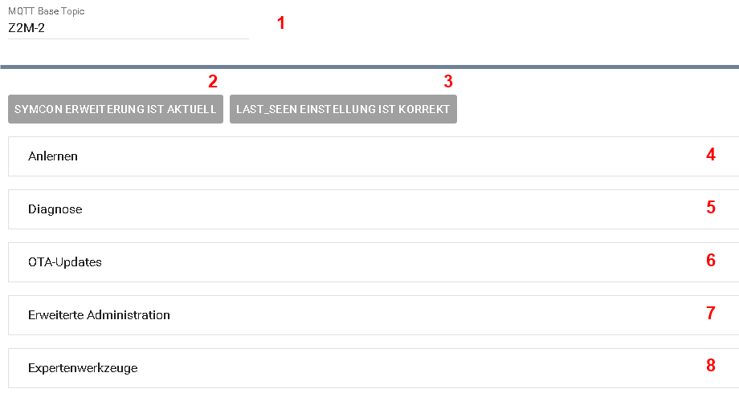

[](https://www.symcon.de/service/dokumentation/entwicklerbereich/sdk-tools/sdk-php/)
[](https://community.symcon.de/t/modul-zigbee2mqtt-version-5-x/139819)
[](https://www.symcon.de/de/service/dokumentation/einfuehrung/systemvoraussetzungen/versionenuebersicht/#version-90)
[](https://creativecommons.org/licenses/by-nc-sa/4.0/)
[](https://github.com/Nall-chan/Zigbee2MQTT/actions)
[](https://github.com/Nall-chan/Zigbee2MQTT/actions)  

# Zigbee2MQTT-Bridge  <!-- omit in toc -->

   Modul für alle Systemweiten Funktionen von Zigbee2MQTT

## Inhaltsverzeichnis <!-- omit in toc -->

- [1. Funktionsumfang](#1-funktionsumfang)
- [2. Voraussetzungen](#2-voraussetzungen)
- [3. Software-Installation](#3-software-installation)
- [4. Konfiguration](#4-konfiguration)
- [5. Statusvariablen](#5-statusvariablen)
- [6. PHP-Funktionsreferenz](#6-php-funktionsreferenz)
- [7. Aktionen](#7-aktionen)
- [8. Anhang](#8-anhang)
  - [1. Changelog](#1-changelog)
  - [2. Spenden](#2-spenden)
  - [3. Lizenz](#3-lizenz)

## 1. Funktionsumfang

- Verfügbarkeit von Zigbee2MQTT in Symcon darstellen (Online-Variable)
- Verwaltung der für das Modul benötigten Extension in Zigbee2MQTT
- Systemweite Einstellungen in Zigbee2MQTT aus Symcon anpassen
- Netzwerkbeitritt aus Symcon steuern und darstellen
- Diagnosebereich für Health Check, Coordinator Check, Bridge-Events, Warnungen/Fehler und auffällige Geräte
- Viele PHP-Funktionen um interne Zigbee2MQTT Funktionen auszuführen (Gruppen verwalten, Geräte umbenennen usw...)
  
## 2. Voraussetzungen

- mindestens IP-Symcon Version 9.0
- MQTT-Broker (interner MQTT-Server von Symcon oder externer z.B. Mosquitto)
- installiertes und lauffähiges [zigbee2mqtt](https://www.zigbee2mqtt.io)  
  
## 3. Software-Installation

- Dieses Modul ist Bestandteil der [Zigbee2MQTT-Library](../README.md#3-installation).  

## 4. Konfiguration

   

| **Nummer** | **Feld**            | **Beschreibung**                                                                                                                                                |
| ---------- | ------------------- | --------------------------------------------------------------------------------------------------------------------------------------------------------------- |
| **1**      | **MQTT Base Topic** | Dieses wird vom [Konfigurator](../Configurator/README.md) bei Anlage der Instanz automatisch auf den korrekten Wert gesetzt und sollte auch so belassen werden. |
| **2**      | **Erweiterung**     | Über diese Schaltfläche kann die Erweiterung in Z2M eingerichtet oder aktualisert werden, sofern dies nicht automatisch erfolgt ist.                            |
| **3**      | **last_seen**       | In Z2M muss die Einstellung `last_seen` auf den Wert `epoch` eingerichtet sein, da es sonst zu Fehlermeldungen bei den Variablen `Zuletzt gesehen` kommt.       |
| **4**      | **Testcenter**      | Hier sind die Schaltbaren Statusvariablen aufgeführt, so kann z.B. der Netzwerkbeitritt aktiviert werden.                                                       |

## 5. Statusvariablen

| Name                               | Typ     | Profil              | Beschreibung                                 |
| ---------------------------------- | ------- | ------------------- | -------------------------------------------- |
| Beitritt zum Netzwerk zulassen     | bool    | ~Switch             | Status und Steuern des Netzwerkbeitritt      |
| Erweiterung geladen                | bool    |                     | true wenn die Erweiterung geladen wurde      |
| Erweiterung ist aktuell            | bool    |                     | true wenn die Erweiterung aktuell ist        |
| Erweiterung Version                | string  |                     | Version der Erweiterung                      |
| Netzwerkkanal                      | integer |                     | Netzwerkkanal des Zigbee-Netzwerks           |
| Neustart durchführen               | integer | Z2M.bridge.restart  | Action Variable um einen Neustart auszulösen |
| Neustart erforderlich              | bool    |                     | true wenn eine Neustart von Z2M nötig ist    |
| Protokollierung                    | string  | Z2M.brigde.loglevel | Status der Softwareaktualisierung            |
| Status                             | bool    | ~Alert.Reversed     | Online Status von Zigbee2MQTT                |
| Version                            | string  |                     | Version von Zigbee2MQTT                      |
| Zigbee Herdsman Converters Version | string  |                     | Version des Zigbee Herdsman Converters       |
| Zigbee Herdsman Version            | string  |                     | Version vom Zigbee Herdsman-Modul            |

## 6. PHP-Funktionsreferenz

Die Bridge-Funktionen senden Zigbee2MQTT-Requests an das `bridge/request/...` Topic und werten die Antwort von Zigbee2MQTT aus.
Bei einer erfolgreichen Antwort wird `true` zurückgegeben, bei einem Fehler oder Timeout `false`.

Lange laufende Requests wie Netzwerkkarte und OTA-Aktualisierung werden nur angestoßen und laufen anschließend in Zigbee2MQTT weiter. In diesem Fall bedeutet `true`, dass der Request erfolgreich an Zigbee2MQTT übergeben wurde.

### Z2M_InstallSymconExtension <!-- omit in toc -->

```php
bool Z2M_InstallSymconExtension(int $InstanzID);
```

Die aktuelle Symcon Erweiterung wird in Z2M installiert.  

---

### Z2M_RequestOptions <!-- omit in toc -->

```php
bool Z2M_RequestOptions(int $InstanzID);
```

Fordert die aktuellen Bridge-Optionen von Zigbee2MQTT an und aktualisiert die Bridge-Instanz anhand der Antwort.

---

### Z2M_SetLastSeen <!-- omit in toc -->

```php
bool Z2M_SetLastSeen(int $InstanzID);
```

Die Konfiguration der `last_seen` Einstellung in Z2M wird auf `epoch` verändert, damit die Instanzen in Symcon den Wert korrekt darstellen können.  

---

### Z2M_SetPermitJoinOption <!-- omit in toc -->

```php
bool Z2M_SetPermitJoinOption(int $InstanzID, bool $PermitJoin);
```

Setzt die globale Zigbee2MQTT-Option `permit_join`. Diese Option sollte aus Sicherheitsgründen normalerweise deaktiviert sein.

---

### Z2M_SetPermitJoin <!-- omit in toc -->

```php
bool Z2M_SetPermitJoin(int $InstanzID, bool $PermitJoin);
```

---

### Z2M_SetLogLevel <!-- omit in toc -->

```php
bool Z2M_SetLogLevel(int $InstanzID, string $LogLevel);
```

---

### Z2M_Restart <!-- omit in toc -->

```php
bool Z2M_Restart(int $InstanzID);
```

---

### Z2M_CreateGroup <!-- omit in toc -->

```php
bool Z2M_CreateGroup(int $InstanzID, string $GroupName);
```

---

### Z2M_DeleteGroup <!-- omit in toc -->

```php
bool Z2M_DeleteGroup(int $InstanzID, string $GroupName);
```

---

### Z2M_RenameGroup <!-- omit in toc -->

```php
bool Z2M_RenameGroup(int $InstanzID, string $OldName, string $NewName);
```

---

### Z2M_AddDeviceToGroup <!-- omit in toc -->

```php
bool Z2M_AddDeviceToGroup(int $InstanzID, string $GroupName, string $DeviceName, string $Endpoint = '');
```

Fügt ein Gerät einer Gruppe hinzu. Bei Geräten mit mehreren Endpoints kann `Endpoint` mit dem Endpoint-Namen oder der Endpoint-ID gefüllt werden.

---

### Z2M_RemoveDeviceFromGroup <!-- omit in toc -->

```php
bool Z2M_RemoveDeviceFromGroup(int $InstanzID, string $GroupName, string $DeviceName, string $Endpoint = '', bool $SkipDisableReporting = true);
```

Entfernt ein Gerät aus einer Gruppe. `SkipDisableReporting` verhindert, dass Zigbee2MQTT beim Entfernen automatisch Reporting deaktiviert.

---

### Z2M_RemoveAllDevicesFromGroup <!-- omit in toc -->

```php
bool Z2M_RemoveAllDevicesFromGroup(int $InstanzID, string $GroupName);
```

---

### Z2M_RemoveDeviceFromAllGroups <!-- omit in toc -->

```php
bool Z2M_RemoveDeviceFromAllGroups(int $InstanzID, string $DeviceName, bool $SkipDisableReporting = true);
```

Entfernt ein Gerät aus allen Zigbee2MQTT-Gruppen.

---

### Z2M_SetGroupOptions <!-- omit in toc -->

```php
bool Z2M_SetGroupOptions(int $InstanzID, string $GroupName, string $OptionsJSON);
```

Setzt Zigbee2MQTT-Gruppenoptionen. `OptionsJSON` muss ein JSON-Objekt sein, z.B. `{"transition":1}`.

---

### Z2M_StoreScene <!-- omit in toc -->

```php
bool Z2M_StoreScene(int $InstanzID, string $FriendlyName, int $SceneID, string $SceneName = '', int $GroupID = 0);
```

Speichert den aktuellen Zustand eines Geräts oder einer Gruppe als Szene. Optional kann ein Name und bei Geräteszenen eine Gruppen-ID mitgegeben werden.

---

### Z2M_AddScene <!-- omit in toc -->

```php
bool Z2M_AddScene(int $InstanzID, string $FriendlyName, string $SceneJSON);
```

Legt eine Szene mit vollständiger Szenendefinition an. `SceneJSON` muss ein JSON-Objekt enthalten, z.B. `{"ID":3,"name":"Abend","brightness":180}`.

---

### Z2M_RecallScene <!-- omit in toc -->

```php
bool Z2M_RecallScene(int $InstanzID, string $FriendlyName, int $SceneID);
```

Ruft eine gespeicherte Szene auf.

---

### Z2M_RemoveScene <!-- omit in toc -->

```php
bool Z2M_RemoveScene(int $InstanzID, string $FriendlyName, int $SceneID);
```

Entfernt eine Szene.

---

### Z2M_RemoveAllScenes <!-- omit in toc -->

```php
bool Z2M_RemoveAllScenes(int $InstanzID, string $FriendlyName);
```

Entfernt alle Szenen eines Geräts oder einer Gruppe.

---

### Z2M_RenameScene <!-- omit in toc -->

```php
bool Z2M_RenameScene(int $InstanzID, string $FriendlyName, int $SceneID, string $SceneName);
```

Benennt eine Szene um.

---

### Z2M_Bind <!-- omit in toc -->

```php
bool Z2M_Bind(int $InstanzID, string $SourceDevice, string $TargetDevice);
```

---

### Z2M_BindWithOptions <!-- omit in toc -->

```php
bool Z2M_BindWithOptions(int $InstanzID, string $SourceDevice, string $TargetDevice, string $ClustersJSON, bool $SkipDisableReporting);
```

Erstellt ein Binding mit optionaler Cluster-Auswahl. `ClustersJSON` kann ein JSON-Array wie `["genOnOff"]` oder eine kommaseparierte Liste sein.

---

### Z2M_Unbind <!-- omit in toc -->

```php
bool Z2M_Unbind(int $InstanzID, string $SourceDevice, string $TargetDevice);
```

---

### Z2M_UnbindWithOptions <!-- omit in toc -->

```php
bool Z2M_UnbindWithOptions(int $InstanzID, string $SourceDevice, string $TargetDevice, string $ClustersJSON, bool $SkipDisableReporting);
```

Entfernt ein Binding mit optionaler Cluster-Auswahl. Mit `SkipDisableReporting` kann verhindert werden, dass Zigbee2MQTT automatisch zugehöriges Reporting entfernt.

---

### Z2M_ClearBinds <!-- omit in toc -->

```php
bool Z2M_ClearBinds(int $InstanzID, string $DeviceName);
```

Entfernt alle Bindings eines Geräts über `bridge/request/device/binds/clear`.

---

### Z2M_ConfigureReporting <!-- omit in toc -->

```php
bool Z2M_ConfigureReporting(int $InstanzID, string $DeviceName, string $Endpoint, string $Cluster, string $Attribute, int $MinimumReportInterval, int $MaximumReportInterval, string $ReportableChange, string $OptionsJSON);
```

Konfiguriert Zigbee Attribute Reporting. `ReportableChange` kann leer bleiben, wenn das Attribut keinen Change-Wert unterstützt. `OptionsJSON` ist optional und muss bei Nutzung ein JSON-Objekt sein.

---

### Z2M_ReadReporting <!-- omit in toc -->

```php
string Z2M_ReadReporting(int $InstanzID, string $DeviceName, string $Endpoint, string $Cluster, string $AttributesJSON, string $ManufacturerCode);
```

Liest die Reporting-Konfiguration eines oder mehrerer Attribute. `AttributesJSON` kann ein JSON-Array oder eine kommaseparierte Attributliste sein. Rückgabe ist ein JSON-String mit den Antwortdaten oder leer bei Fehler.

---

### Z2M_RequestNetworkmap <!-- omit in toc -->

```php
bool Z2M_RequestNetworkmap(int $InstanzID);
```

Fordert die Zigbee-Netzwerkkarte in Zigbee2MQTT an. Die Anfrage wird asynchron gesendet, da die Erstellung der Netzwerkkarte länger dauern kann.
Das Ergebnis wird nach Eingang der Zigbee2MQTT-Antwort in der Bridge-Instanz als Variable `Netzwerkkarte` abgelegt.

---

### Z2M_HealthCheck <!-- omit in toc -->

```php
bool Z2M_HealthCheck(int $InstanzID);
```

Führt `bridge/request/health_check` aus und speichert das Ergebnis im Diagnosebereich der Bridge. `true` bedeutet, dass Zigbee2MQTT `healthy: true` gemeldet hat.

---

### Z2M_CoordinatorCheck <!-- omit in toc -->

```php
bool Z2M_CoordinatorCheck(int $InstanzID);
```

Führt `bridge/request/coordinator_check` aus und zeigt fehlende Router im Diagnosebereich der Bridge an. `true` bedeutet, dass keine fehlenden Router gemeldet wurden.

---

### Z2M_ClearBridgeDiagnostics <!-- omit in toc -->

```php
bool Z2M_ClearBridgeDiagnostics(int $InstanzID);
```

Leert die gesammelten Bridge-Events, Warnungen/Fehler und Gerätediagnosen. Die letzten Health- und Coordinator-Check-Ergebnisse bleiben erhalten.

---

### Z2M_RenameDevice <!-- omit in toc -->

```php
bool Z2M_RenameDevice(int $InstanzID, string $OldDeviceName, string $NewDeviceName);
```

---

### Z2M_RemoveDevice <!-- omit in toc -->

```php
bool Z2M_RemoveDevice(int $InstanzID, string $DeviceName);
```

---

### Z2M_SetDeviceOptions <!-- omit in toc -->

```php
bool Z2M_SetDeviceOptions(int $InstanzID, string $DeviceName, string $OptionsJSON);
```

Setzt Zigbee2MQTT-Geräteoptionen über `bridge/request/device/options`. `OptionsJSON` muss ein JSON-Objekt sein, z. B. `{"transition":1}` oder `{"filtered_attributes":["battery"]}`.

---

### Z2M_CheckOTAUpdate <!-- omit in toc -->

```php
bool Z2M_CheckOTAUpdate(int $InstanzID, string $DeviceName);
```

Prüft, ob für das angegebene Gerät ein OTA-Update verfügbar ist.
`true` bedeutet, dass Zigbee2MQTT ein verfügbares Update meldet. `false` bedeutet entweder kein verfügbares Update oder einen Fehler bei der Anfrage.

---

### Z2M_CheckOTAUpdateWithUrl <!-- omit in toc -->

```php
bool Z2M_CheckOTAUpdateWithUrl(int $InstanzID, string $DeviceName, string $Url);
```

Prüft ein OTA-Update gegen einen eigenen OTA-Index. `Url` kann eine erreichbare URL oder ein lokaler Pfad aus Sicht der Zigbee2MQTT-Installation sein.

---

### Z2M_CheckOTADowngrade <!-- omit in toc -->

```php
bool Z2M_CheckOTADowngrade(int $InstanzID, string $DeviceName);
```

Prüft, ob für das angegebene Gerät ein OTA-Downgrade verfügbar ist.

---

### Z2M_CheckOTADowngradeWithUrl <!-- omit in toc -->

```php
bool Z2M_CheckOTADowngradeWithUrl(int $InstanzID, string $DeviceName, string $Url);
```

Prüft ein OTA-Downgrade gegen einen eigenen OTA-Index. `Url` kann eine erreichbare URL oder ein lokaler Pfad aus Sicht der Zigbee2MQTT-Installation sein.

---

### Z2M_PerformOTAUpdate <!-- omit in toc -->

```php
bool Z2M_PerformOTAUpdate(int $InstanzID, string $DeviceName);
```

Startet ein OTA-Update für das angegebene Gerät. Die Anfrage wird asynchron gesendet, da der Updatevorgang in Zigbee2MQTT länger dauern kann.
`true` bedeutet, dass der Update-Request an Zigbee2MQTT übergeben wurde.

---

### Z2M_PerformOTAUpdateWithUrl <!-- omit in toc -->

```php
bool Z2M_PerformOTAUpdateWithUrl(int $InstanzID, string $DeviceName, string $Url);
```

Startet ein OTA-Update mit einer eigenen Firmware-Datei oder einem eigenen OTA-Index. Die Anfrage wird asynchron gesendet.

---

### Z2M_PerformOTADowngrade <!-- omit in toc -->

```php
bool Z2M_PerformOTADowngrade(int $InstanzID, string $DeviceName);
```

Startet ein OTA-Downgrade für das angegebene Gerät. Die Anfrage wird asynchron gesendet.

---

### Z2M_PerformOTADowngradeWithUrl <!-- omit in toc -->

```php
bool Z2M_PerformOTADowngradeWithUrl(int $InstanzID, string $DeviceName, string $Url);
```

Startet ein OTA-Downgrade mit einer eigenen Firmware-Datei oder einem eigenen OTA-Index. Die Anfrage wird asynchron gesendet.

---

### Z2M_ScheduleOTAUpdate <!-- omit in toc -->

```php
bool Z2M_ScheduleOTAUpdate(int $InstanzID, string $DeviceName);
```

Plant ein OTA-Update für die nächste OTA-Anfrage des Geräts. Das ist besonders für batteriebetriebene Geräte hilfreich.

---

### Z2M_ScheduleOTAUpdateWithUrl <!-- omit in toc -->

```php
bool Z2M_ScheduleOTAUpdateWithUrl(int $InstanzID, string $DeviceName, string $Url);
```

Plant ein OTA-Update mit eigener Firmware-Datei oder eigenem OTA-Index für die nächste OTA-Anfrage des Geräts.

---

### Z2M_ScheduleOTADowngrade <!-- omit in toc -->

```php
bool Z2M_ScheduleOTADowngrade(int $InstanzID, string $DeviceName);
```

Plant ein OTA-Downgrade für die nächste OTA-Anfrage des Geräts.

---

### Z2M_ScheduleOTADowngradeWithUrl <!-- omit in toc -->

```php
bool Z2M_ScheduleOTADowngradeWithUrl(int $InstanzID, string $DeviceName, string $Url);
```

Plant ein OTA-Downgrade mit eigener Firmware-Datei oder eigenem OTA-Index für die nächste OTA-Anfrage des Geräts.

---

### Z2M_UnscheduleOTAUpdate <!-- omit in toc -->

```php
bool Z2M_UnscheduleOTAUpdate(int $InstanzID, string $DeviceName);
```

Hebt eine geplante OTA-Aktualisierung oder ein geplantes OTA-Downgrade für das angegebene Gerät wieder auf.

## 7. Aktionen

Keine Aktionen verfügbar.

## 8. Anhang

### 1. Changelog

[Changelog der Library](../README.md#5-changelog)

### 2. Spenden

Dieses Modul ist für die nicht kommerzielle Nutzung kostenlos, Schenkungen als Unterstützung für den Autor werden hier akzeptiert:

<a href="https://www.paypal.com/cgi-bin/webscr?cmd=_s-xclick&hosted_button_id=EK4JRP87XLSHW" target="_blank"></a> <a href="https://www.amazon.de/hz/wishlist/ls/3JVWED9SZMDPK?ref_=wl_share" target="_blank">Amazon Wunschzettel</a>

### 3. Lizenz

[CC BY-NC-SA 4.0](https://creativecommons.org/licenses/by-nc-sa/4.0/)
