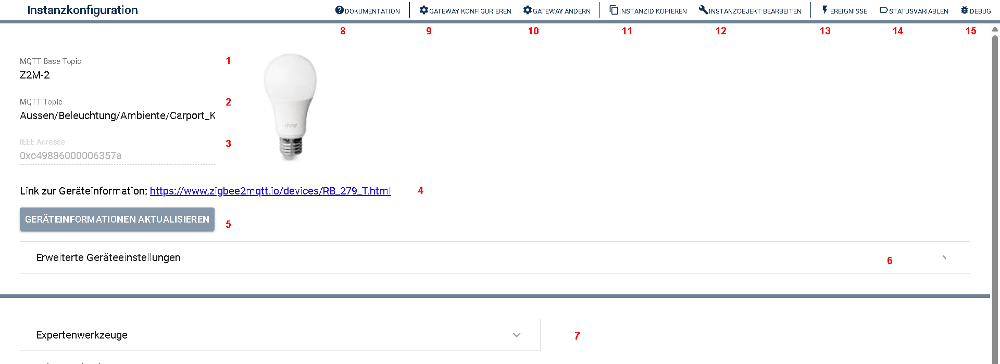
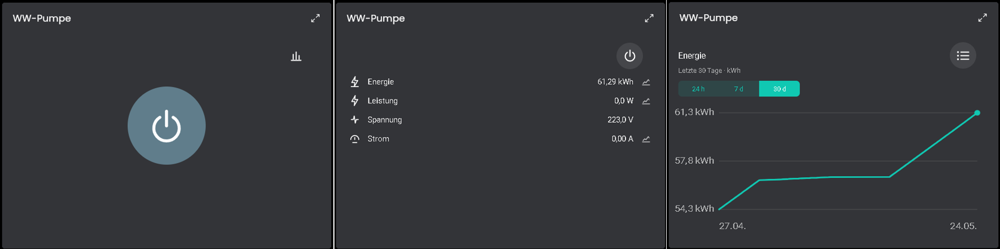
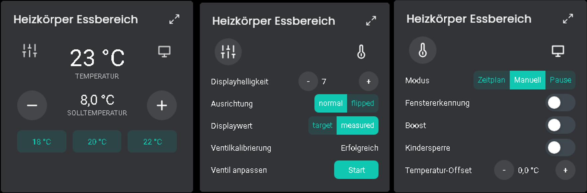
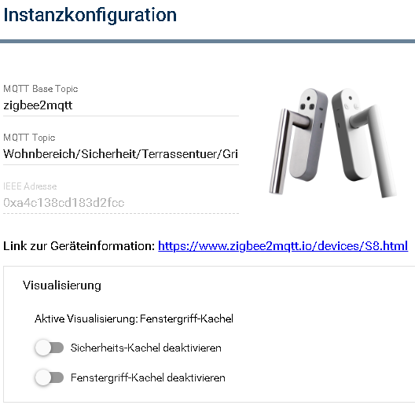
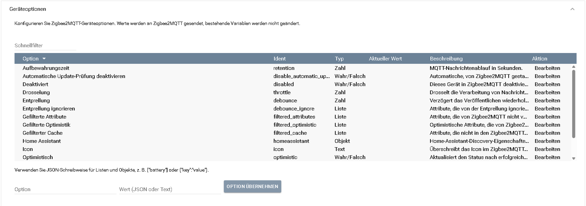
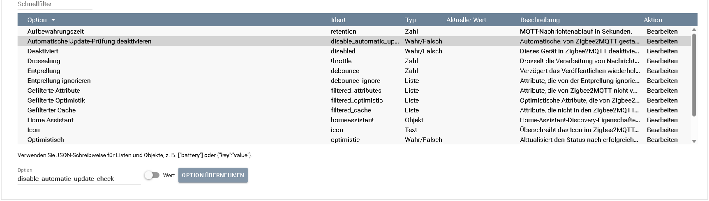
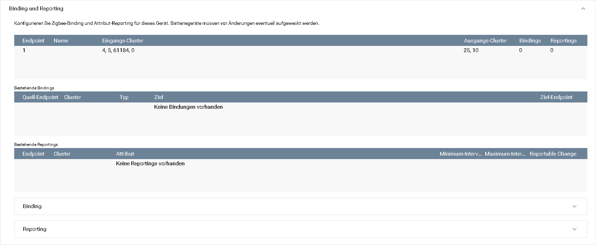
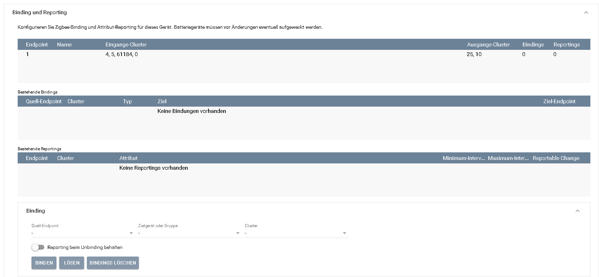
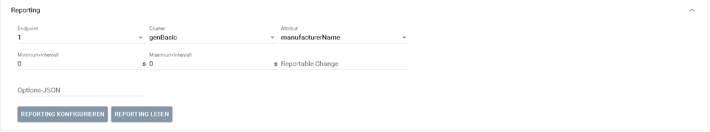
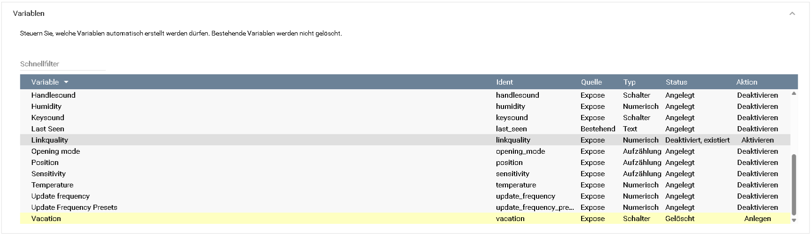

[](https://www.symcon.de/service/dokumentation/entwicklerbereich/sdk-tools/sdk-php/)
[](https://community.symcon.de/t/modul-zigbee2mqtt-version-5-x/139819)
[](https://www.symcon.de/de/service/dokumentation/einfuehrung/systemvoraussetzungen/versionenuebersicht/#version-90)
[](https://creativecommons.org/licenses/by-nc-sa/4.0/)
[](https://github.com/Nall-chan/Zigbee2MQTT/actions)
[](https://github.com/Nall-chan/Zigbee2MQTT/actions)  

# Zigbee2MQTT-Gerät  <!-- omit in toc -->  

   Mit diesem Module werden die Geräte von Zigbee2MQTT in IP-Symcon als Instanz abgebildet

## Inhaltsverzeichnis <!-- omit in toc -->  

- [1. Funktionsumfang](#1-funktionsumfang)
- [2. Voraussetzungen](#2-voraussetzungen)
- [3. Software-Installation](#3-software-installation)
- [4. Konfiguration](#4-konfiguration)
  - [4.1 Praxisablauf nach dem Anlegen](#41-praxisablauf-nach-dem-anlegen)
  - [4.2 Visualisierung und Kacheln](#42-visualisierung-und-kacheln)
  - [4.3 Temperatur-Visualisierung](#43-temperatur-visualisierung)
  - [4.4 Farbtemperatur in der Beleuchtungs-Kachel](#44-farbtemperatur-in-der-beleuchtungs-kachel)
  - [4.5 Gerätewartung](#45-gerätewartung)
  - [4.6 Erweiterte Geräteentfernung](#46-erweiterte-geräteentfernung)
  - [4.7 Geräteoptionen](#47-geräteoptionen)
  - [4.8 Binding und Reporting](#48-binding-und-reporting)
  - [4.9 Variablenverwaltung](#49-variablenverwaltung)
  - [4.10 Troubleshooting](#410-troubleshooting)
- [5. Statusvariablen](#5-statusvariablen)
- [6. PHP-Funktionsreferenz](#6-php-funktionsreferenz)
- [7. Aktionen](#7-aktionen)
- [8. Anhang](#8-anhang)
  - [1. Changelog](#1-changelog)
  - [2. Spenden](#2-spenden)
  - [3. Lizenz](#3-lizenz)

## 1. Funktionsumfang

- Darstellung aller von Z2M gelieferten Werte in Symcon
- Inklusive der Verfügbarkeit des Gerätes als Variable (Online-Variable), wenn dies in Z2M aktiviert ist: [availability](https://www.zigbee2mqtt.io/guide/configuration/device-availability.html).
- Automatisches Erstellen der für die Variablen benötigten Variablenprofile gemäß den Daten aus Z2M
- Automatische Zuordnung moderner Tile-Darstellungen und passender Standardprofile, soweit die Exposes dies zulassen
- Eigene HTML-SDK-Kacheln für häufige Gerätetypen wie Schaltaktoren mit Messwerten, Heizungen, Sensoren, Sicherheitskontakte, Fenstergriffe und Aktionsgeräte
- Komfortable Pflege von Zigbee2MQTT-Geräteoptionen inklusive typisierter Editoren und Attributauswahl
- Gerätewartung für ein erneutes Interview oder eine erneute gerätespezifische Konfiguration
- Bestätigungspflichtige Expertenaktionen für normales, erzwungenes oder anschließend blockiertes Entfernen eines Geräts
- Binding- und Reporting-Verwaltung anhand der von Zigbee2MQTT gelieferten Endpoint- und Cluster-Daten
- Variablenverwaltung für automatisch erkannte, nachgelieferte, deaktivierte oder vom Anwender gelöschte Variablen
- Erstellen von Variablen für reine Aktionen wie Voreinstellungen wählen, Effekte aufrufen oder Identifizieren starten
  
## 2. Voraussetzungen

- mindestens IP-Symcon Version 9.0
- MQTT-Broker (interner MQTT-Server von Symcon oder externer z.B. Mosquitto)
- installiertes und lauffähiges [zigbee2mqtt](https://www.zigbee2mqtt.io)  
  
## 3. Software-Installation

- Dieses Modul ist Bestandteil der [Zigbee2MQTT-Library](../README.md#3-installation).  

## 4. Konfiguration

  

| **Nummer** | **Feld**                        | **Beschreibung**                                                                                                                                                                                                                                                                                                                                                                                                                                                                                                                                                                                                                                      |
| ---------- | ------------------------------- | ----------------------------------------------------------------------------------------------------------------------------------------------------------------------------------------------------------------------------------------------------------------------------------------------------------------------------------------------------------------------------------------------------------------------------------------------------------------------------------------------------------------------------------------------------------------------------------------------------------------------------------------------------- |
| **1**      | **MQTT Base Topic**             | Dieses wird vom [Konfigurator](../Configurator/README.md) bei Anlage der Instanz automatisch auf den korrekten Wert gesetzt und sollte auch so belassen werden.                                                                                                                                                                                                                                                                                                                                                                                                                                                                                       |
| **2**      | **MQTT Topic**                  | Das Topic, welches die Instanz in Z2M nutzt. Beim Anlernen von Geräten an Z2M erhält jedes Gerät einen Namen (`friendly_name`). Standard ist hier die IEEE-Adresse. Dies kann im Nachgang aber geändert werden.<br>**Bei jeder Änderung des Namen ändert sich auch das Topic in MQTT.**<br>Entsprechend muss das neue Topic in Symcon übernommen werden. Dies kann per Hand, oder über den [Konfigurator](../Configurator/README.md) erfolgen (Prüfen Button), welcher geänderte Topics anhand der Geräte IEEE Adresse erkennt.                                                                                                                       |
| **3**      | **IEEE Adresse**                | Anhand dieser Adresse ist, unabhängig vom Topic, eine eindeutige Identifikation von Geräten in Z2M möglich. **Die IEEE Adresse sollte nicht geändert werden!** Ausnahme wäre der 1:1 Austausch von einem baugleichen Gerät, so muss die Instanz in Symcon nicht gelöscht und neu angelegt werden.                                                                                                                                                                                                                                                                                                                                                     |
| **4**      | **Geräteinformationen**         | Hier wird der Link zum Gerät in der Z2M Doku angezeigt und das entsprechende Bild von dem Gerät. Die Bilder werden von Z2M bereit gestellt und können teilweise abweichen.                                                                                                                                                                                                                                                                                                                                                                                                                                                                            |
| **5**      | **Geräteinformationen aktualisieren** | Über diesen Button können alle Informationen zu einem Gerät aus Z2M erneut abgerufen werden. Dies ist manchmal notwendig, wenn das Gerät bezüglich der betreffenden Daten (exposes) aus Z2M ein Update erhalten hat (z.B. neue Effekte oder zusätzliche Datenpunkte). Beim Anlegen der Instanz wird dies automatisch durchgeführt. Nach der manuellen Aktualisierung zeigt die Konfiguration eine verständliche Erfolgs- oder Fehlermeldung.                                                                                                                                                                                                             |
| **6**      | **Testcenter**                  | Hier werden alle Statusvariablen der Instanz welche bedienbar (steuerbar) sind von der Konsole dargestellt. Somit ist ein Funktionstest schnell möglich.                                                                                                                                                                                                                                                                                                                                                                                                                                                                                              |
| **7**      | **Dokumentation**               | Direkter Zugriff auf die Dokumentation der Instanz.                                                                                                                                                                                                                                                                                                                                                                                                                                                                                                                                                                                                   |
| **8**      | **Gateway konfigurieren**       | Unter diesem Punkt kann der verbundene MQTT-Splitter (Client oder Server) aufgerufen werden.                                                                                                                                                                                                                                                                                                                                                                                                                                                                                                                                                          |
| **9**      | **Gateway ändern**              | Dient zur Auswahl des von der Instanz genutzten MQTT-Splitters (Client oder Server). Wird beim Anlegen von Geräten über den [Konfigurator](../Configurator/README.md) automatisch gesetzt und kann auch über diesen korrigiert werden.                                                                                                                                                                                                                                                                                                                                                                                                                |
| **10**     | **InstanzID kopieren**          | Kopiert die Instanz ID in die Zwischenablage.                                                                                                                                                                                                                                                                                                                                                                                                                                                                                                                                                                                                         |
| **11**     | **Instanzobjekt bearbeiten**    | Öffnet den gleichen Dialog wie im Objektbaum unter `Instanz bearbeiten`.                                                                                                                                                                                                                                                                                                                                                                                                                                                                                                                                                                              |
| **12**     | **Ereignisse**                  | Zeigt eine Übersicht, welche Ereignisse mit der Instanz verbunden sind. Über den Button Neu lassen sich neue Ereignisse zu der Instanz einrichten (Ausgelöst, zyklisch oder per Wochenplan). Die zugehörigen Ereignisse können direkt bearbeitet werden.                                                                                                                                                                                                                                                                                                                                                                 |
| **13**     | **Statusvariablen**             | Hier lassen sich alle der Instanz zugehörigen Variablen bearbeiten                                                                                                                                                                                                                                                                                                                                                                                                                                                                                                                                                    |
| **14**     | **Debug**                       | Öffnet eine Debug-Ausgabe dieser Instanz. Protokolle der Debug-Ausgabe werden im Fehlerfall von den Entwicklern abgefragt. Da hier u.a. auch zu sehen ist, ob Werte des MQTT-Expose oder Payload nicht zugeordnet werden können, Profile fehlen, Schaltaktionen nicht ausgeführt werden können usw...<br>Sollte es Probleme mit einer Instanz geben, können diese nur adäquat bearbeitet werden, wenn der Meldung (unter Issues oder im Forum) ein Debug beigelegt wird. Dazu bitte im Debug-Fenster zuerst das Limit ausschalten und später über  die heruntergeladene Debug-Datei der Meldung im Forum beifügen. |

### 4.1 Praxisablauf nach dem Anlegen

Nach dem Anlegen einer Geräteinstanz sind in der Regel nur wenige Schritte nötig. Die meisten Einstellungen werden automatisch aus den von Zigbee2MQTT gelieferten Geräteinformationen abgeleitet.

Die Konfiguration priorisiert die tägliche Bedienung: **Visualisierung** bleibt als eigener Bereich sichtbar. Seltener benötigte, aber regulär unterstützte Funktionen wie **Gerätewartung**, **Geräteoptionen**, **Variablen** sowie **Binding und Reporting** befinden sich gesammelt unter **Erweiterte Geräteeinstellungen**. Erweiterte Geräteentfernung, Debug-Export, IEEE-Adressänderung, fehlende Übersetzungen und Testcenter sind unter **Expertenwerkzeuge** zusammengefasst.

1. **Geräteinformationen prüfen oder neu abrufen**
   Kontrollieren Sie, ob Gerätebild, Modell-Link, IEEE-Adresse und MQTT-Topic passen. Wenn Zigbee2MQTT neue oder geänderte Exposes liefert, können die Informationen über **Geräteinformationen aktualisieren** neu geladen werden. Eine erfolgreiche Aktualisierung wird im Formular bestätigt.

2. **Variablen prüfen**
   Öffnen Sie unter **Erweiterte Geräteeinstellungen** den Bereich **Variablen** und prüfen Sie, welche Werte angelegt, deaktiviert, gelöscht oder noch nicht angelegt sind. Deaktivierte Variablen werden nicht automatisch neu erzeugt, können dort aber später wieder aktiviert werden.

3. **Visualisierung prüfen**
   Im Bereich **Visualisierung** zeigt das Modul, welche Kachel automatisch verwendet wird. Wenn mehrere Darstellungen fachlich passen, kann eine spezielle Kachel deaktiviert werden, damit die nächste passende Darstellung oder die Symcon-Standarddarstellung verwendet wird.

4. **Geräteoptionen nur bei Bedarf anpassen**
   Optionen wie `transition`, `debounce`, `retain`, `optimistic` oder `filtered_attributes` sollten nur geändert werden, wenn das gewünschte Verhalten bekannt ist. Änderungen werden direkt an Zigbee2MQTT gesendet.

5. **Binding und Reporting nur bewusst konfigurieren**
   Binding und Reporting greifen direkt in Zigbee-Funktionen ein. Sie sind hilfreich für direkte Geräteverknüpfungen oder angepasste Meldeintervalle, sollten aber erst genutzt werden, wenn klar ist, welche Endpoints, Cluster und Attribute das Gerät unterstützt.

6. **Funktion testen**
   Bedienbare Variablen können im Testcenter oder in der Tile-Visualisierung geprüft werden. Wenn Aktionen nicht funktionieren, hilft der Debug der Instanz, weil dort die gesendeten MQTT-Payloads und mögliche Zuordnungsprobleme sichtbar sind.

### 4.2 Visualisierung und Kacheln

Das Modul prüft anhand der Zigbee2MQTT-Exposes automatisch, ob eine eigene HTML-SDK-Kachel sinnvoll ist. Wenn eine passende Kachel verfügbar ist, wird diese automatisch als Visualisierung der Instanz verwendet. In der Konfiguration erscheint dann der Bereich **Visualisierung** mit der aktuell aktiven Kachel und den passenden Abschaltoptionen.

Es werden nur Optionen angezeigt, die für das jeweilige Gerät fachlich passen. Ein einfacher Temperatursensor zeigt also keine Schalter-Kachel-Option, ein Schaltaktor ohne Messwerte keine Messwert-Kachel-Option.

| Kachel | Typische Exposes | Darstellung |
| ------ | ---------------- | ----------- |
| Heizungs-Kachel | `occupied_heating_setpoint`, `local_temperature`, optional Ventil- und Betriebswerte | Ist- und Solltemperatur als Hauptansicht mit Plus-/Minus-Tasten und Presets, Detailseiten für weitere Heizungswerte und Einstellungen |
| Schalter-/Leistungsmessungs-Kachel | `state`, optional `state_1` bis `state_4`, `power`, `energy`, `voltage`, `current`, `ac_frequency`, `power_factor`, `power_apparent`, `power_reactive`, `produced_energy`, `consumption` | Schalten auf der Hauptseite, mehrere Schaltausgänge in einer Kachel, Messwertseite mit optionalem Archiv-Graphen bei archivierten Variablen |
| Fenstergriff-Kachel | `position`, `alarm`, optional `action`, `action_left`, `action_right`, `button_left`, `button_right` | Griffzustand Geschlossen/Offen/Gekippt, Alarmstatus und Tasten |
| Sicherheits-Kachel | z.B. `contact`, `window_open`, `opening_state`, `alarm_state`, `tamper`, `smoke`, `gas`, `water_leak`, `battery_low` | Status-/Alarmdarstellung mit Priorität auf Kontakt- bzw. Öffnungszustand, Detailseite für Alarm-, Batterie- und Sirenenwerte |
| Aktions-Kachel | Taster-, Fernbedienungs-, Button- oder Szenen-Exposes | Letzte Aktion und verfügbare Aktionswerte |
| Sensor-Kachel | z.B. `temperature`, `humidity`, `soil_moisture`, `illuminance`, `occupancy`, `motion`, `presence`, `target_distance` | Messwertdarstellung für reine Sensoren und Radar-/Präsenzmelder, inklusive Detail-/Einstellseite wenn passende Einstellwerte vorhanden sind |

#### Beispiel Schaltaktor mit Leistungsmessung


Bei kombinierten Aktor-/Sensorgeräten bleibt die automatische Auswahl zunächst bei der Aktor- bzw. Standarddarstellung. Sobald passende Sensorwerte vorhanden sind, kann in der Instanzkonfiguration bewusst **Sensor-Kachel verwenden** aktiviert werden.

Die drei Solltemperatur-Presets der Heizungs-Kachel sind pro Instanz im Bereich **Visualisierung** konfigurierbar. Standardwerte sind `18,0 °C`, `20,0 °C` und `22,0 °C`.


Die eigenen Kacheln geben keine festen Schriftarten oder Grundfarben vor. Dadurch übernehmen sie Hell-/Dunkelmodus, Schrift und Basisfarben der Symcon Tile-Visualisierung. Eigene Farben werden nur für fachliche Zustände verwendet, z. B. Alarm, OK, aktiv, inaktiv oder den Farbverlauf eines Messwerts.

Wenn mehrere Kacheln fachlich passen, gilt folgende Priorität:

1. Heizungs-Kachel
2. Schalter-/Leistungsmessungs-Kachel
3. Fenstergriff-Kachel
4. Sicherheits-Kachel
5. Aktions-Kachel
6. Sensor-Kachel
7. Standard-Visualisierung von Symcon

Die höher priorisierte Kachel kann in der Instanz-Konfiguration deaktiviert werden, wenn stattdessen die nächste passende Kachel oder die Standard-Visualisierung verwendet werden soll.



Für Gerätetypen, die Symcon bereits nativ gut darstellen kann, erstellt das Modul bewusst keine eigene HTML-Kachel. Rollladen/Jalousien mit `type: "cover"` und `position` werden über die Symcon-Shutter-Darstellung bzw. das Standardprofil `~Shutter.Reversed` abgebildet. Einfache Türschlösser, Lüfter oder Sirenen bleiben bei den passenden Standarddarstellungen wie Schalter, Slider oder Aufzählung, solange die Exposes keine eigenständige zusammengefasste Kachel nötig machen.

### 4.3 Temperatur-Visualisierung

Für Temperatur-Exposes setzt das Modul automatisch eine moderne Tile-Darstellung. Wenn Zigbee2MQTT `value_min` und `value_max` liefert, werden diese Werte für den Darstellungsbereich genutzt.

Falls ein Temperatur-Expose keinen Wertebereich mitliefert, verwendet das Modul den Fallback-Bereich aus der Instanz-Konfiguration. Standard ist:

| Einstellung | Standard |
| ----------- | -------- |
| Minimum | `-40,0 °C` |
| Maximum | `80,0 °C` |

Der Bereich ist nur für die Darstellung relevant. Er ändert keine Gerätewerte und keine von Zigbee2MQTT gelieferten Exposes.

### 4.4 Farbtemperatur in der Beleuchtungs-Kachel

Für Leuchtmittel mit `color_temp` legt das Modul zusätzlich die Variable `color_temp_kelvin` an. Diese Variable wird für die Farbtemperatur-Seite der Symcon-Standardkachel **Beleuchtung** verwendet, damit die Bedienung in Kelvin statt in Mired erfolgt.

Zigbee2MQTT liefert den Bereich für `color_temp` normalerweise in Mired. Das Modul rechnet diesen Bereich automatisch in Kelvin um:

| Zigbee2MQTT Expose | Symcon-Variable | Darstellung |
| ------------------ | --------------- | ----------- |
| `color_temp` | `color_temp` | Mired-Wert für Zigbee2MQTT |
| `color_temp` | `color_temp_kelvin` | Kelvin-Bedienung für die Beleuchtungs-Kachel |

Wenn Zigbee2MQTT `value_min` und `value_max` für `color_temp` liefert, wird daraus der Kelvin-Bereich berechnet. Mired und Kelvin laufen dabei entgegengesetzt: ein kleiner Mired-Wert bedeutet eine hohe Kelvin-Zahl, ein großer Mired-Wert eine niedrige Kelvin-Zahl. Beispiel: Aus `value_min: 200` und `value_max: 454` wird ungefähr `2202 K` bis `5000 K`.

Falls kein Wertebereich vorhanden ist, verwendet das Modul den Standardbereich `1000 K` bis `12000 K`. Zusätzlich wird ein Farbverlauf von Warmweiß bis Kaltweiß gesetzt, der zum jeweiligen Kelvin-Bereich passt.

Einige Zigbee2MQTT-Device-Definitionen melden für `color_temp` jedoch einen zu großen oder nicht zum konkreten Leuchtmittel passenden Bereich. Das ist kein Fehler der Symcon-Visualisierung und kein Fehler dieses Moduls: Das Modul kann zunächst nur die Werte verwenden, die Zigbee2MQTT über das Expose liefert. Wenn die Zigbee2MQTT-Definition z. B. `153..555 mired` meldet, ergibt das rechnerisch ungefähr `1801 K` bis `6535 K`, auch wenn das reale Leuchtmittel nur etwa `2202 K` bis `5000 K` unterstützt.

Für solche Fälle kann der Kelvin-Bereich in der Instanz-Konfiguration unter **Farbtemperatur-Visualisierung** überschrieben werden:

| Einstellung | Bedeutung |
| ----------- | --------- |
| `Minimum = 0` und `Maximum = 0` | Bereich automatisch aus dem Zigbee2MQTT-Expose berechnen |
| `Minimum > 0` und `Maximum > 0` | diesen Kelvin-Bereich für die Symcon-Darstellung verwenden |

Der Override korrigiert die Symcon-Darstellung der `color_temp_kelvin`-Variable, begrenzt Kelvin-Aktionen auf diesen Bereich und passt die abgeleitete Weiß-Farbe entsprechend an. Er ändert keine Zigbee2MQTT-Device-Definition und keine technischen Fähigkeiten des Leuchtmittels.

Bei reinen Tunable-White-Leuchtmitteln ohne RGB/HS/XY-Farb-Expose legt das Modul zusätzlich eine abgeleitete Variable `color` mit dem Profil `~HexColor` an. Diese Variable zeigt den aktuellen Weißton als Farbe an, bleibt aber eine reine Darstellung und ersetzt keine echte RGB-Steuerung.

### 4.5 Gerätewartung

Unter **Erweiterte Geräteeinstellungen** steht für konfigurierte Geräte der Bereich **Gerätewartung** zur Verfügung. Die beiden Aktionen greifen direkt auf die offiziellen Zigbee2MQTT-Requests [`device/interview`](https://www.zigbee2mqtt.io/guide/usage/mqtt_topics_and_messages.html#zigbee2mqtt-bridge-request-device-interview) und [`device/configure`](https://www.zigbee2mqtt.io/guide/usage/mqtt_topics_and_messages.html#zigbee2mqtt-bridge-request-device-configure) zu.

| Aktion | Verwendung |
| --- | --- |
| **Gerät erneut interviewen** | Liest Endpoints, Cluster und Basisattribute erneut vom Gerät ein. Dies ist besonders nach Firmwareupdates oder bei unvollständigen Endpoint- und Geräteinformationen sinnvoll. |
| **Gerät neu konfigurieren** | Führt die in der Zigbee2MQTT-Gerätedefinition hinterlegte Konfiguration erneut aus. Dies kann fehlende Bindings oder Reporting-Einstellungen wiederherstellen. Nicht jedes Gerät besitzt eine solche Configure-Definition. |

#### Was bedeutet „Gerät neu konfigurieren“?

Zigbee2MQTT-Gerätedefinitionen können eine gerätespezifische `configure`-Funktion enthalten. Diese wird normalerweise nach dem Anlernen eines Geräts ausgeführt und richtet das Gerät so ein, wie es der jeweilige Zigbee2MQTT-Gerätetreiber erwartet. Über **Gerät neu konfigurieren** wird genau diese Funktion erneut ausgeführt.

Abhängig von der Gerätedefinition kann Zigbee2MQTT dabei:

- benötigte Cluster an den Coordinator binden,
- automatische Reporting-Intervalle und Änderungsschwellen einrichten,
- gerätespezifische Attribute lesen oder schreiben,
- herstellerspezifische Grundeinstellungen erneut setzen.

Die Aktion führt **keinen Factory-Reset** durch, lernt das Gerät nicht neu an und ändert weder Friendly Name noch allgemeine Geräteoptionen. Sie kann jedoch zuvor manuell angepasste Bindings oder Reporting-Einstellungen wieder auf die von der Zigbee2MQTT-Gerätedefinition vorgesehenen Werte setzen. Deshalb sollte sie vor allem verwendet werden, wenn Werte nicht mehr gemeldet werden, Bindings fehlen oder ein Gerät nach einem Firmwareupdate nicht mehr vollständig arbeitet.

Enthält die Zigbee2MQTT-Gerätedefinition keine `configure`-Funktion, kann das Gerät nicht neu konfiguriert werden. Zigbee2MQTT meldet dies entsprechend zurück.

Beide Aktionen müssen vor dem Start bestätigt werden und können bis zu zwei Minuten dauern. Batteriegeräte müssen unmittelbar vorher aufgeweckt werden. Nach erfolgreichem Interview sollten **Geräteinformationen aktualisieren**, nach erfolgreicher Konfiguration bei Bedarf **Endpoint-Daten aktualisieren** ausgeführt werden. Fehler und Zeitüberschreitungen erscheinen als verständliche Meldung in der Geräte-Konfiguration.

### 4.6 Erweiterte Geräteentfernung

Unter **Expertenwerkzeuge** steht für konfigurierte Geräte der Bereich **Erweiterte Geräteentfernung** zur Verfügung. Jede Aktion muss über einen eigenen Hinweisdialog bestätigt werden. Das Entfernen aus Zigbee2MQTT löscht weder die zugehörige Symcon-Instanz noch ihre Variablen.

| Aktion | Verhalten |
| --- | --- |
| **Gerät normal entfernen** | Zigbee2MQTT fordert das erreichbare Gerät auf, das Zigbee-Netzwerk zu verlassen. Das Gerät muss online sein; Batteriegeräte müssen eventuell aufgeweckt werden. |
| **Entfernen erzwingen** | Löscht das Gerät ausschließlich aus der Zigbee2MQTT-Datenbank. Das Gerät behält den Netzwerkschlüssel und kann bis zu einem Factory-Reset weiterhin mit dem Netzwerk kommunizieren. |
| **Gerät entfernen und blockieren** | Entfernt das Gerät regulär und fügt es anschließend der Zigbee2MQTT-Blocklist hinzu, damit es dem Netzwerk nicht erneut beitreten kann. |

Erzwungenes Entfernen sollte nur verwendet werden, wenn die reguläre Entfernung dauerhaft fehlschlägt. Vor einem erneuten Anlernen muss das Gerät anschließend auf Werkseinstellungen zurückgesetzt werden. Ein blockiertes Gerät muss zuerst aus der Blocklist der Bridge entfernt werden, bevor es erneut beitreten kann.

Die Aktionen verwenden den offiziellen Zigbee2MQTT-Request [`device/remove`](https://www.zigbee2mqtt.io/guide/usage/mqtt_topics_and_messages.html#zigbee2mqtt-bridge-request-device-remove) mit den optionalen Parametern `force` und `block`.

### 4.7 Geräteoptionen

Zigbee2MQTT liefert je nach Gerät allgemeine und gerätespezifische Optionen. In der Instanz-Konfiguration erscheint dafür unter **Erweiterte Geräteeinstellungen** der Bereich **Geräteoptionen**. Dort werden bekannte Optionen mit aktuellem Wert, Typ und Beschreibung angezeigt.



Wird eine Option über `Bearbeiten` ausgewählt, passt sich der Editor an den Optionstyp an. Bei `Wahr/Falsch` erscheint z. B. ein Schalter, bei Listen eine JSON-/Attributauswahl und bei Zahlen oder Texten ein Eingabefeld.



Die Änderung wird über `bridge/request/device/options` an Zigbee2MQTT gesendet. Wenn eine passende Bridge-Instanz mit gleichem MQTT-Basistopic vorhanden ist, wird diese für die Anfrage genutzt und die Zigbee2MQTT-Antwort geprüft.

Soweit der Typ bekannt ist, zeigt das Formular passende Editoren:

| Optionstyp | Darstellung |
| ---------- | ----------- |
| Boolean/Binary | Schalter |
| Enum/Select | Auswahlliste mit bekannten Werten |
| Numeric | Zahlen-/Textfeld mit Typkonvertierung |
| Text | Textfeld |
| Array | JSON-Array oder, bei Attributoptionen, eine auswählbare Attributliste |
| Object | JSON-Objekt |

Das Modul kennt die häufigsten allgemeinen Zigbee2MQTT-Geräteoptionen wie `debounce`, `debounce_ignore`, `disable_automatic_update_check`, `disabled`, `filtered_attributes`, `filtered_cache`, `filtered_optimistic`, `homeassistant`, `icon`, `optimistic`, `qos`, `retain`, `retention`, `throttle` und `transition`. Zusätzlich werden gerätespezifische Optionen aus `definition.options` angezeigt, wenn Zigbee2MQTT sie für das Gerät liefert.

Häufige Optionen in Kurzform:

| Option | Bedeutung |
| --- | --- |
| `transition` | Übergangszeit in Sekunden, z. B. für Ein-/Ausschalten, Helligkeit oder Farbwechsel bei Leuchtmitteln. |
| `debounce` | Entprellt schnelle Meldungen. Mehrere Werte innerhalb der angegebenen Zeit werden zusammengefasst bzw. verzögert verarbeitet. |
| `optimistic` | Zigbee2MQTT veröffentlicht erwartete Zustände direkt nach einem Set-Befehl, auch bevor das Gerät den Zustand bestätigt hat. |
| `retain` | MQTT-Nachrichten dieses Geräts werden vom Broker behalten. Neue MQTT-Clients erhalten dadurch den letzten bekannten Wert sofort. |
| `filtered_attributes` | Filtert ausgewählte Attribute aus veröffentlichten Payloads heraus. Das kann nützlich sein, wenn bestimmte Werte nicht verarbeitet werden sollen. |
| `disabled` | Deaktiviert das Gerät in Zigbee2MQTT, z. B. damit es von Scans oder Verfügbarkeitsprüfungen ausgenommen wird. |
| `qos` | MQTT-Quality-of-Service für Nachrichten dieses Geräts. Standard ist meistens ausreichend. |

Für Listen und Objekte muss JSON-Schreibweise verwendet werden, z. B. `["battery"]` für `filtered_attributes` oder `{"key":"value"}` für Objektwerte. Bei Attributoptionen schlägt das Formular bekannte Payload-Attribute aus Exposes, Variablenkatalog und vorhandenen Variablen vor.

Optionen, die Zigbee2MQTT erst nach einem Neustart übernimmt, lösen in der Bridge eine entsprechende Meldung aus.

### 4.8 Binding und Reporting

Binding und Reporting sind Zigbee-Funktionen, mit denen Geräte direkter und effizienter miteinander arbeiten können. Beim Binding sendet ein Gerät bestimmte Cluster direkt an ein Zielgerät oder eine Zielgruppe, ohne dass jede Aktion erst über eine Automatisierung abgebildet werden muss. Reporting legt fest, welche Attribute ein Gerät selbstständig meldet und in welchen Intervallen oder ab welcher Änderung neue Werte übertragen werden. Beides ist besonders bei Tastern, Leuchtmitteln, Sensoren und batteriebetriebenen Geräten hilfreich, sollte aber bewusst konfiguriert werden, da nicht jedes Gerät jeden Cluster oder jedes Attribut unterstützt.



Wenn Zigbee2MQTT Endpoint-Daten liefert, zeigt die Instanz-Konfiguration unter **Erweiterte Geräteeinstellungen** den Bereich **Binding und Reporting**. Dort sind Endpoints, Eingangs-/Ausgangscluster sowie vorhandene Bindings und konfigurierte Reportings sichtbar. Bekannte Bindings werden zusätzlich als eigene Übersicht mit Quell-Endpoint, Cluster, Zieltyp, Ziel und Ziel-Endpoint aufgelistet. Konfigurierte Reportings werden separat mit Endpoint, Cluster, Attribut, Intervallen und Reportable Change angezeigt.

Vorhandene Bindings und Reportings werden aus dem von Zigbee2MQTT veröffentlichten `bridge/devices` Cache gelesen. Zigbee2MQTT stellt dafür keinen separaten "Binding lesen"-Request bereit. Wenn ein Binding gerade erst angelegt oder in Zigbee2MQTT geändert wurde, kann die Anzeige zunächst leer bleiben. Mit **Endpoint-Daten aktualisieren** liest die Device-Konfiguration den aktuellen Bridge-Cache erneut ein und baut die Übersichten neu auf. Der Button ruft keine Geräteinformationen über die Symcon-Extension ab und ist deshalb unabhängig vom `getDeviceInfo` Request.

Über den Binding-Bereich können Geräte oder Gruppen direkt gebunden oder wieder gelöst werden. Der Quell-Endpoint wird aus den bekannten Endpoints des Geräts als Auswahl angeboten. Als Ziel können lokale Zigbee2MQTT-Geräte- und Gruppeninstanzen sowie von Zigbee2MQTT gemeldete Geräte und Gruppen ausgewählt werden. Die Cluster-Auswahl wird aus den bekannten Clustern des Quell-Endpoints aufgebaut und beim Wechsel von Endpoint oder Zielgerät aktualisiert. Bleibt der Quell-Endpoint leer, wird das Gerät ohne Endpoint-Suffix verwendet.



Ein typisches Beispiel ist ein Zigbee-Taster, der eine Lampe oder eine Gruppe direkt schalten soll:

1. Beim Taster den Bereich **Binding** öffnen.
2. Den passenden **Quell-Endpoint** auswählen. Bei einfachen Geräten ist das häufig `1`.
3. Als **Zielgerät oder Gruppe** die gewünschte Lampe oder Zigbee2MQTT-Gruppe auswählen.
4. Als **Cluster** z. B. `genOnOff` für Ein/Aus oder `genLevelCtrl` für Helligkeit auswählen.
5. Mit **Binden** die direkte Zigbee-Verknüpfung erstellen.

Nach einem erfolgreichen Binding kann der Taster das Zielgerät auch dann direkt ansprechen, wenn keine Symcon-Automation dafür angelegt wurde. Ob ein Gerät Binding unterstützt und welche Cluster sinnvoll sind, hängt vom Gerät ab.

Über den Reporting-Bereich kann Attribute Reporting gelesen oder konfiguriert werden. Endpoint, Cluster und Attribut werden als Auswahl angeboten und aus den bekannten Endpoint-Daten, bereits konfigurierten Reportings und typischen Zigbee-Clustern abgeleitet. Batteriebetriebene Geräte müssen dafür unter Umständen direkt vor dem Ausführen geweckt werden. Nicht jedes Gerät und nicht jedes Attribut unterstützt Reporting.



Für die Bedienung sind vor allem diese Felder wichtig:

| Feld | Bedeutung |
| --- | --- |
| `Endpoint` | Der Geräte-Endpunkt, für den das Reporting geändert werden soll. Bei einfachen Geräten ist meistens nur ein Endpoint vorhanden. |
| `Cluster` | Der Zigbee-Funktionsbereich, z. B. `genOnOff`, `msTemperatureMeasurement` oder `haElectricalMeasurement`. |
| `Attribut` | Der konkrete Wert innerhalb des Clusters, der automatisch gemeldet werden soll. |
| `Minimum-Intervall` | Frühester Abstand zwischen zwei automatischen Meldungen. Ein zu kleiner Wert kann das Zigbee-Netz und Batteriegeräte belasten. |
| `Maximum-Intervall` | Spätester Abstand, nach dem das Gerät den Wert erneut melden soll, auch wenn er sich nicht geändert hat. |
| `Reportable Change` | Änderungsschwelle, ab der ein neuer Wert gemeldet wird. Das Feld kann leer bleiben, wenn das Attribut keine Schwelle unterstützt. |
| `Options-JSON` | Optionales Expertenfeld für zusätzliche Zigbee2MQTT-Optionen. Im Normalfall bleibt es leer. |

`Reporting konfigurieren` schreibt die ausgewählten Einstellungen an Zigbee2MQTT. `Reporting lesen` fragt die aktuell im Gerät hinterlegte Reporting-Konfiguration ab. Wenn ein Gerät nicht antwortet oder ein Attribut nicht unterstützt, muss die Einstellung am Gerät selbst geprüft werden; bei Batteriegeräten hilft oft, das Gerät direkt vor dem Ausführen aufzuwecken.

Die Endpoint-Liste wird aus den von Zigbee2MQTT gelieferten Geräteinformationen aufgebaut. Sie zeigt Endpoint, Name, Eingangscluster, Ausgangscluster sowie die Anzahl bekannter Bindings und konfigurierter Reportings.

### 4.9 Variablenverwaltung

Die Instanz merkt sich alle aus Exposes, Payloads und Systemmeldungen bekannten Variablen in einem lokalen Variablenkatalog. In der Konfiguration erscheint dazu unter **Erweiterte Geräteeinstellungen** der Bereich **Variablen**. Dort kann pro Variable gesteuert werden, ob das Modul sie automatisch anlegen darf.



Über **Variablen aktualisieren** wird die Liste bewusst neu aus den aktuellen Exposes und dem zuletzt empfangenen Geräte-Payload aufgebaut. Dadurch verschwinden historische Einträge, die das Gerät nicht mehr liefert. Die zugehörigen Symcon-Variablen werden dabei nicht gelöscht und können anschließend kontrolliert über die Variablen-Wartung der Bridge geprüft werden. Ausdrücklich deaktivierte oder gelöschte Einträge bleiben erhalten, solange sie weiterhin fachlich zum aktuellen Gerät gehören.

Einzelne Variablen können über die Aktion in der jeweiligen Zeile angelegt, aktiviert oder deaktiviert werden. Die Liste wird dabei nur aktualisiert und das Formular springt nicht mehr an den Anfang der Konfiguration.

Die wichtigsten Zustände in der Liste sind:

| Status | Bedeutung | Aktion |
| --- | --- | --- |
| `Angelegt` | Die Variable existiert im Objektbaum und darf vom Modul verwaltet werden. | `Deaktivieren` |
| `Nicht angelegt` | Die Variable ist aus Exposes, Payloads oder Systemmeldungen bekannt, existiert aber noch nicht im Objektbaum. | `Anlegen` |
| `Deaktiviert, existiert` | Die Variable existiert noch im Objektbaum, ist aber für die automatische Neuanlage gesperrt. | `Aktivieren` |
| `Gelöscht` | Die Variable ist erlaubt, fehlt aber im Objektbaum. | `Anlegen` |

Deaktivierte Variablen werden nicht automatisch gelöscht. Bestehende Variablen bleiben erhalten, werden aber nach einer manuellen Löschung nicht wieder neu erzeugt, solange sie deaktiviert sind.

Typische Fälle in der Praxis:

| Fall | Verhalten |
| --- | --- |
| Eine nicht benötigte Variable wird im Objektbaum gelöscht | Die Variable wird als `Gelöscht` erkannt. Sie wird erst wieder angelegt, wenn im Bereich **Variablen** die Aktion `Anlegen` ausgeführt wird. |
| Eine Variable wird über `Deaktivieren` gesperrt | Das Modul legt diese Variable nicht automatisch neu an. Existiert sie noch im Objektbaum, bleibt sie erhalten. |
| Ein Wert erscheint später erstmals im Payload | Die Variable wird im Katalog als bekannt aufgenommen. Wenn sie erlaubt ist, kann sie automatisch angelegt oder über `Anlegen` nachträglich erstellt werden. |
| Update- und Systemwerte wie `update__*` oder `last_seen` fehlen in den Exposes | Das ist normal. Diese Werte kommen oft erst später über Payloads oder Systemmeldungen. Bei einem laut Zigbee2MQTT OTA-fähigen Gerät bleiben stabile OTA-Metadaten wie installierte und neueste Version oder Update-Status beim manuellen Aktualisieren der Variablenliste erhalten. Temporäre Werte wie `update__progress` und `update__remaining` bleiben nur sichtbar, solange sie im zuletzt empfangenen Geräte-Payload tatsächlich enthalten sind. Historische OTA-Werte werden nicht dauerhaft für Geräte ohne gemeldete OTA-Fähigkeit geführt. |

Composite-Exposes werden dabei auf die tatsächlich anlegbaren Untervariablen reduziert. Ein nicht selbst nutzbarer Composite-Elternknoten wird nicht als eigene Variable angeboten, während Unterwerte wie `options__motor_speed` sauber im Variablenkatalog erscheinen.

### 4.10 Troubleshooting

Bei Problemen mit einer Geräteinstanz hilft zuerst der Debug der Instanz. Dort ist sichtbar, welche Payloads von Zigbee2MQTT empfangen werden, welche Variablen erkannt werden und welche Befehle an Zigbee2MQTT gesendet werden.

| Problem | Mögliche Ursache | Vorgehen |
| --- | --- | --- |
| Keine Endpoint-Daten vorhanden | Zigbee2MQTT hat für das Gerät noch keine Endpoint-Informationen geliefert oder `bridge/devices` wurde noch nicht aktualisiert. | **Endpoint-Daten aktualisieren** ausführen und prüfen, ob Zigbee2MQTT das Gerät vollständig interviewt hat. Falls grundsätzliche Gerätedaten fehlen, zusätzlich **Geräteinformationen aktualisieren** ausführen und die Symcon-Erweiterung prüfen. |
| Geräteinformationen können nicht abgerufen werden | Zigbee2MQTT oder die Symcon-Extension antwortet nicht rechtzeitig auf den `getDeviceInfo` Request. Das kann kurz nach einem Z2M-Neustart, bei hoher Last oder bei einer nicht aktuellen Extension passieren. | Einige Sekunden warten und erneut versuchen. Wenn es dauerhaft auftritt, prüfen, ob Zigbee2MQTT online ist und die Symcon-Extension aktuell installiert wurde. Die Instanz zeigt dafür eine lesbare Meldung im Formular. |
| Vorhandenes Binding wird nicht angezeigt | Die Binding-Übersicht wird aus `bridge/devices` gelesen. Nach einem neuen Binding kann der Cache erst verzögert aktualisiert werden. | **Endpoint-Daten aktualisieren** ausführen. Bleibt die Liste leer, in Zigbee2MQTT prüfen, ob das Binding dort unter dem Gerät angezeigt wird und ob `bridge/devices` aktuelle Endpoint-Daten enthält. |
| Binding oder Reporting zeigt keine Cluster oder Attribute | Für den gewählten Endpoint sind keine passenden Cluster bekannt oder das Gerät unterstützt die Funktion nicht. | Endpoint wechseln, Geräteinformationen neu abrufen und in Zigbee2MQTT prüfen, welche Cluster das Gerät tatsächlich anbietet. Bei Batteriegeräten das Gerät vorher aufwecken. |
| Gerät offline oder antwortet nicht | Das Gerät ist nicht erreichbar, schläft, hat keine Route oder ist in Zigbee2MQTT als offline markiert. | Gerät aufwecken, Stromversorgung/Batterie prüfen und in Zigbee2MQTT kontrollieren, ob es online ist. Danach die Aktion erneut ausführen. |
| Geräteinterview schlägt fehl | Das Gerät antwortet während des Interviews nicht oder ein Batteriegerät schläft wieder ein. | Gerät aufwecken und **Gerät erneut interviewen** wiederholen. Nach Erfolg anschließend **Geräteinformationen aktualisieren** ausführen. |
| Gerät kann nicht neu konfiguriert werden | Das Gerät ist nicht erreichbar oder seine Zigbee2MQTT-Definition enthält keine Configure-Funktion. | Gerät aufwecken und erneut versuchen. Meldet Zigbee2MQTT weiterhin, dass das Gerät nicht konfiguriert werden kann, unterstützt die Gerätedefinition diese Aktion nicht. |
| Gerät kann nicht normal entfernt werden | Das Gerät ist offline, schläft oder antwortet nicht auf die Aufforderung, das Netzwerk zu verlassen. | Gerät aufwecken und **Gerät normal entfernen** erneut ausführen. Nur wenn dies dauerhaft fehlschlägt, unter **Expertenwerkzeuge** das Entfernen erzwingen. |
| Kachel erscheint nicht oder es wird die Standarddarstellung verwendet | Die benötigten Exposes fehlen, eine höher priorisierte Kachel ist aktiv oder die Spezialkachel wurde in der Instanz deaktiviert. | Bereich **Visualisierung** prüfen, Geräteinformationen neu abrufen und kontrollieren, ob die für die gewünschte Kachel nötigen Exposes vorhanden sind. |
| Farbtemperaturbereich passt nicht | Zigbee2MQTT meldet für `color_temp` einen zu großen oder falschen Mired-Bereich. | Im Bereich **Farbtemperatur-Visualisierung** eigene Kelvin-Minimum- und Maximumwerte setzen. Mit `0`/`0` wird wieder der Zigbee2MQTT-Expose-Bereich verwendet. |
| Variable wird nach dem Löschen nicht wieder angelegt | Die Variable ist im Variablenkatalog als gelöscht oder deaktiviert vermerkt. | Im Bereich **Variablen** die betroffene Variable über `Anlegen` wieder erstellen oder über `Aktivieren` für die automatische Anlage freigeben. |
| Bedienaktion sendet den falschen Wert | Das Profil oder die Expose-Zuordnung passt nicht zum Gerät, z. B. bei enum-basierten `state`-Variablen. | Im Debug prüfen, welcher Payload gesendet wird. Bei Rollladen und ähnlichen Geräten müssen Originalwerte wie `OPEN`, `CLOSE` oder `STOP` gesendet werden. |

## 5. Statusvariablen

Die Statusvariablen werden je nach Funktion und Fähigkeiten der Geräte dynamisch erstellt.  

## 6. PHP-Funktionsreferenz

### RequestAction <!-- omit in toc -->  

   ```php
   RequestAction(int $VariablenID, mixed $Value);
   ```  

   Mit dieser Funktion können alle Aktionen einer Variable ausgelöst werden.  

   > [!IMPORTANT]
   > Bei der Nutzung von RequestAction innerhalb eines Aktionsskriptes darf nicht die Variable übergeben werden, welche dieses Aktionsskript nutzt. Sonst wird eine Endlosschleife ausgelöst. Anstatt RequestAction sind die Z2M_Command oder Z2M_WriteValue* Instanz-Funktionen zu benutzen.

   **Beispiel:**

   Variable ID Status: 12345

   ```php
   RequestAction(12345, true); //Einschalten
   RequestAction(12345, false); //Ausschalten
   ```

   Bei enum-basierten `state`-Variablen werden die Originalwerte von Zigbee2MQTT gesendet. Das ist z. B. für Rollladen wichtig, deren `state` nicht `ON`/`OFF`, sondern `OPEN`, `CLOSE` und `STOP` erwartet.

   ```php
   RequestAction(12345, 'OPEN');  // Rollladen öffnen
   RequestAction(12345, 'STOP');  // Rollladen stoppen
   RequestAction(12345, 'CLOSE'); // Rollladen schließen
   ```

---

### Z2M_WriteValueBoolean <!-- omit in toc -->

   ```php
   bool Z2M_WriteValueBoolean(int $InstanzId, string $Ident, bool $Value);
   ```

   Mit dieser Funktion können Bool Werte an eine Instanz gesendet werden.

   **Beispiel:**

   Variablen-Ident `state` der Instanz 12345

   ```php
   Z2M_WriteValueBoolean(12345, 'state', true); //Einschalten
   ```

---

### Z2M_WriteValueInteger <!-- omit in toc -->

   ```php
   bool Z2M_WriteValueInteger(int $InstanzId, string $Ident, int $Value);
   ```

   Mit dieser Funktion können Integer Werte an eine Instanz gesendet werden.

   **Beispiel:**

   Variablen-Ident `position` der Instanz 12345

   ```php
   Z2M_WriteValueInteger(12345, 'position', 50); // Setze Position auf 50
   ```

---

### Z2M_WriteValueFloat <!-- omit in toc -->

   ```php
   bool Z2M_WriteValueFloat(int $InstanzId, string $Ident, float $Value);
   ```

   Mit dieser Funktion können Float Werte an eine Instanz gesendet werden.

   **Beispiel:**

   Variablen-Ident `calibration_time` der Instanz 12345

   ```php
   Z2M_WriteValueFloat(12345, 'calibration_time', 22.5); // Setze Kalibrierung auf 22,5 Sekunden
   ```

---

### Z2M_WriteValueString <!-- omit in toc -->

   ```php
   bool Z2M_WriteValueString(int $InstanzId, string $Ident, string $Value);
   ```

   Mit dieser Funktion können String Werte an eine Instanz gesendet werden.

   **Beispiel:**

   Variablen-Ident `effect` der Instanz 12345

   ```php
   Z2M_WriteValueString(12345, 'effect', 'blink'); // Effekt Blinken ausführen
   ```

   ---

### Z2M_ReadValue <!-- omit in toc -->

   ```php
   bool Z2M_ReadValue(int $InstanzId, string $Property);
   ```

   Mit dieser Funktion wird eine Leseanfrage für eine bestimmte Eigenschaft an das Gerät gesendet.

   **Beispiel:**

   Property `wifi_status` der Instanz 12345

   ```php
   Z2M_ReadValue(12345, 'wifi_status'); // Lese WiFi-Status
   ```

   ---

### Z2M_SendGetCommand <!-- omit in toc -->

   ```php
   bool Z2M_SendGetCommand(int $InstanzId);
   ```

   Mit dieser Funktion wird eine Leseanfrage für alle bekannten Eigenschaften an das Gerät gesendet.

   **Beispiel:**

   ```php
      Z2M_SendGetCommand(12345);
   ```

   Sendet eine Leseanfrage für alle bekannten Eigenschaften an das Gerät der Instanz 12345.

---

### Z2M_SendSetCommand <!-- omit in toc -->

   ```php
   bool Z2M_SendSetCommand(int $InstanzId, array $Payload);
   ```

   Mit dieser Funktion kann ein beliebiger Payload (Datensatz) an das Gerät gesendet werden.

   **Beispiel:**

   ```php
   $Payload['brightness_step_onoff'] = 10;
   Z2M_SendSetCommand(12345, $Payload);
   ```

   Sendet `brightness_step_onoff` mit dem Wert 10 an das Gerät, welches entsprechend die Helligkeit um den Rohwert 10 erhöht und, falls es vorher ausgeschaltet war, eingeschaltet wird.

---

### Z2M_Command <!-- omit in toc -->

   ```php
   bool Z2M_Command(int $InstanzId, string $Topic, string $Value);
   ```

   Mit dieser Funktion kann ein beliebiger Payload (Datensatz) an das Gerät (Geräte-Topic) gesendet werden.

   **Beispiel:**

   ```php
   $Payload['brightness_step_onoff'] = 10;
   Z2M_Command(12345, 'set', json_encode($Payload));
   ```

   Sendet `brightness_step_onoff` mit dem Wert 10 an das Gerät, welches entsprechend die Helligkeit um den Rohwert 10 erhöht und, falls es vorher ausgeschaltet war, eingeschaltet wird.

---

### Z2M_CommandEx <!-- omit in toc -->

   ```php
   bool Z2M_CommandEx(int $InstanzId, string $FullTopic, string $Value);
   ```

   Mit dieser Funktion kann ein beliebiger Payload (Datensatz) an Z2M gesendet werden.

   **Beispiel:**

   ```php
   $Payload['state'] = '';
   Z2M_CommandEx(12345, 'Keller/Lampe1/get', json_encode($Payload));
   ```

   Dieses Beispiel ruft `state` von `{BaseTopic}Keller/Lampe1` ab.

---

### Z2M_SetColorExt <!-- omit in toc -->

   ```php
   bool Z2M_SetColorExt(int $InstanzId, int $Color, int $TransitionTime);
   ```

   Setzt eine Farbe mit Übergangszeit. `Color` ist ein Symcon-Farbwert als Integer, `TransitionTime` die Übergangszeit in Sekunden.

---

### Z2M_UIExportDebugData <!-- omit in toc -->

   ```php
   string Z2M_UIExportDebugData(int $InstanzId);
   ```

   Exportiert die für Support und Fehlersuche relevanten Instanzdaten als JSON-Download. Die Funktion wird vom Button **Download Debug Data** in der Instanz-Konfiguration genutzt.

## 7. Aktionen

> [!NOTE]  
> **Nutzung von Aktionen mit Ziel Variable:**  
> Grundsätzlich können alle bedienbaren Statusvariablen als Ziel einer [`Aktion`](https://www.symcon.de/service/dokumentation/konzepte/automationen/ablaufplaene/aktionen/) mit 'Auf Wert schalten' angesteuert werden, so dass hier keine speziellen Aktionen benutzt werden müssen.

**Zusätzlich** gibt es Sonderfunktionen in Form von speziellen Aktionen, welche für die Zigbee2MQTT-Geräte und Gruppen Instanzen zur Verfügung stehen, wenn diese als Ziel einer Aktion ausgewählt wurden.

Die möglichen Aktionen werden anhand der Statusvariablen der Instanz angeboten, somit sind nicht alle Aktionen immer verfügbar.  

> [!TIP]  
> Über das `i` hinter einer Aktion kann eine Erklärung der Aktion angezeigt werden.  
> Hier als Beispiel das Schrittweise auf/abdimmen.  
>   

Liste aller Aktionen:

| Funktion                            | Voraussetzung (Variable) |
| :---------------------------------- | :------------------------ |
| Einschaltverzögerung                | Countdown                 |
| Ausschaltverzögerung                | Countdown                 |
| Status umschalten                   | Status                    |
| Licht mit Übergangszeit schalten    | Status und Helligkeit      |
| Helligkeit mit Übergangszeit        | Helligkeit                |
| Dimmen der Helligkeit (absolut)     | Helligkeit                |
| Dimmen der Helligkeit (relativ)     | Helligkeit                |
| Dimmen der Farbtemperatur (absolut) | Farbtemperatur            |
| Dimmen der Farbtemperatur (relativ) | Farbtemperatur            |
| Farbtemperatur mit Übergangszeit    | Farbtemperatur in Kelvin  |
| Farbe mit Übergangszeit             | Farbe                     |
| Szene abrufen                       | Zigbee-Szenen-ID           |

Die Aktion **Szene abrufen** wird für Geräte und Gruppen angeboten. Sie setzt voraus, dass die angegebene Szenen-ID zuvor in Zigbee2MQTT für das Ziel gespeichert wurde. Nicht jedes Gerät unterstützt Zigbee-Szenen.

## 8. Anhang

### 1. Changelog

[Changelog der Library](../README.md#5-changelog)

### 2. Spenden

Dieses Modul ist für die nicht kommerzielle Nutzung kostenlos, Schenkungen als Unterstützung für den Autor werden hier akzeptiert:

<a href="https://www.paypal.com/cgi-bin/webscr?cmd=_s-xclick&hosted_button_id=EK4JRP87XLSHW" target="_blank"></a> <a href="https://www.amazon.de/hz/wishlist/ls/3JVWED9SZMDPK?ref_=wl_share" target="_blank">Amazon Wunschzettel</a>

### 3. Lizenz

[CC BY-NC-SA 4.0](https://creativecommons.org/licenses/by-nc-sa/4.0/)
