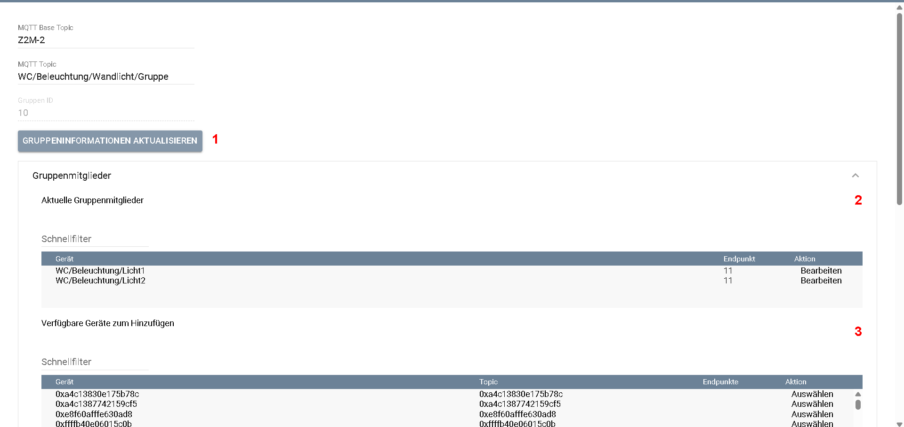

[](https://www.symcon.de/service/dokumentation/entwicklerbereich/sdk-tools/sdk-php/)
[](https://community.symcon.de/t/modul-zigbee2mqtt-version-5-x/139819)
[](https://www.symcon.de/de/service/dokumentation/einfuehrung/systemvoraussetzungen/versionenuebersicht/#version-90)
[](https://creativecommons.org/licenses/by-nc-sa/4.0/)
[](https://github.com/Nall-chan/Zigbee2MQTT/actions)
[](https://github.com/Nall-chan/Zigbee2MQTT/actions)  

# Zigbee2MQTT-Gruppen  <!-- omit in toc -->

   Mit diesem Modul werden die Gruppen von Zigbee2MQTT in IP-Symcon als Instanz abgebildet

## Inhaltsverzeichnis <!-- omit in toc -->

- [1. Funktionsumfang](#1-funktionsumfang)
- [2. Voraussetzungen](#2-voraussetzungen)
- [3. Software-Installation](#3-software-installation)
- [4. Konfiguration](#4-konfiguration)
  - [4.1 Gruppen in Z2M](#41-gruppen-in-z2m)
  - [4.2 Konfiguration](#42-konfiguration)
- [5. Statusvariablen](#5-statusvariablen)
- [6. PHP-Funktionsreferenz](#6-php-funktionsreferenz)
- [7. Aktionen](#7-aktionen)
- [8. Anhang](#8-anhang)
  - [1. Changelog](#1-changelog)
  - [2. Spenden](#2-spenden)
  - [3. Lizenz](#3-lizenz)

## 1. Funktionsumfang

- Darstellung aller von Z2M gelieferten Werten der Gruppe in Symcon
- Automatisches Erstellen der für die Variablen benötigten Variablenprofile gemäß den Daten aus Z2M
- Verwaltung von Gruppenmitgliedern inklusive Endpoint-Auswahl
- Pflege von Zigbee2MQTT-Gruppenoptionen
- Speichern, Abrufen, Umbenennen und Löschen von Szenen
  
## 2. Voraussetzungen

- mindestens IP-Symcon Version 9.0
- MQTT-Broker (interner MQTT-Server von Symcon oder externer z.B. Mosquitto)
- installiertes und lauffähiges [zigbee2mqtt](https://www.zigbee2mqtt.io)  
  
## 3. Software-Installation

- Dieses Modul ist Bestandteil der [Zigbee2MQTT-Library](../README.md#3-installation).  

## 4. Konfiguration

### 4.1 Gruppen in Z2M  

   In Z2M gibt es die Möglichkeit, Geräte in Gruppen zusammen zu fassen und diese dann wie ein einzelnes Gerät zu steuern. Sinn macht Dies zum Beispiel, wenn man mehrere Leuchtmittel als eine Gerät ansprechen will:
     

   Hier als Beispiel die Gruppe `Bad/Beleuchtung/Deckenlicht`:  

   

   Genauere Informationen gibt es direkt auf der Seite von Zigbee2mqtt: [Gerätegruppen](https://www.zigbee2mqtt.io/guide/configuration/devices-groups.html)  

   **Wichtig:**  
   Bitte die Themen in der Z2M-Anleitung genauestens lesen. In Gruppen können nicht alle Eigenschaften der enthaltenen Geräte bedient werden. Zusätzlich lassen sich über Z2M noch Szenen erstellen, welche den Gruppen oder einzelnen Geräten zugeordnet werden können.  

   **Das Handling von Gruppen in Symcon ist dem der einzelnen Geräte gleich.**

### 4.2 Konfiguration

   Die Konfiguration entspricht der Konfiguration der einzelnen [Zigbee2MQTT-Geräte](../Device/README.md#4-konfiguration), mit der Ausnahme, dass die IEEE-Adresse durch die Gruppen-Adresse ersetzt ist und es keine Geräte-Informationen gibt.

     

   Zusätzlich bietet die Gruppeninstanz eigene Bereiche für Gruppenfunktionen:

| Bereich             | Beschreibung                                                                                                                                 |
| ------------------- | -------------------------------------------------------------------------------------------------------------------------------------------- |
| Gruppenmitglieder   | Zeigt die von Zigbee2MQTT gemeldeten Mitglieder der Gruppe. Geräte können mit optionalem Endpoint hinzugefügt oder entfernt werden.          |
| Gruppenoptionen     | Erlaubt Änderungen einzelner Optionen als Auswahlliste, Schalter, JSON-, Zahlen- oder Textwert. |
| Szenen              | Speichert den aktuellen Gruppenstatus als Szene, fügt erweiterte Szenen per JSON hinzu, ruft Szenen ab, benennt sie um oder löscht sie.     |

   Änderungen werden über die Bridge an Zigbee2MQTT gesendet. Wenn Zigbee2MQTT für geänderte Gruppenoptionen einen Neustart verlangt, wird dies in der Bridge protokolliert.

**Gruppenmitglieder**



| Nr. | Bereich | Bedeutung |
| --- | --- | --- |
| **1** | Gruppeninformationen aktualisieren | Liest Mitglieder, Gruppenoptionen und Szenen erneut aus Zigbee2MQTT ein. |
| **2** | Aktuelle Gruppenmitglieder | Zeigt die von Zigbee2MQTT gemeldeten Mitglieder einschließlich ihres Endpoints. Über **Bearbeiten** kann ein Mitglied ausgewählt und anschließend entfernt werden. |
| **3** | Verfügbare Geräte zum Hinzufügen | Zeigt Geräte, die der Gruppe hinzugefügt werden können. Die Liste enthält ausschließlich Geräte desselben MQTT-Splitters und MQTT-Basistopics sowie, wenn möglich, direkt von der zugehörigen Zigbee2MQTT-Erweiterung gelieferte Geräte. |

Dadurch können auch Geräte ausgewählt werden, für die noch keine eigene Symcon-Geräteinstanz angelegt wurde. **Gruppeninformationen aktualisieren** ist insbesondere sinnvoll, wenn Mitglieder oder Szenen außerhalb von Symcon geändert wurden.

Bei mehreren Zigbee2MQTT-Systemen trennt die Gruppeninstanz die verfügbaren Geräte anhand des verbundenen MQTT-Splitters und des MQTT-Basistopics. Geräte eines anderen Zigbee-Netzes werden auch bei identischem Basistopic nicht zur Auswahl angeboten.

Wenn Zigbee2MQTT Endpoints für ein Gerät liefert, werden diese in der Geräteliste angezeigt und nach Auswahl des Geräts als Endpoint-Auswahl angeboten. Bei mehrkanaligen oder mehrfach endpointfähigen Geräten muss der passende Endpoint ausgewählt werden, damit Zigbee2MQTT das Gerät korrekt zur Gruppe hinzufügt.

Beim Entfernen kann **Reporting beim Entfernen behalten** aktiviert bleiben. Dann wird `skip_disable_reporting` an Zigbee2MQTT übergeben, damit vorhandene Reporting-Konfigurationen nicht automatisch entfernt werden.

Antwortet ein Gerät bei einem Gruppenbefehl nicht, zeigt die Gruppeninstanz eine verständliche Meldung **Gerät offline** im Formular. Die technische Zigbee2MQTT-Fehlermeldung wird weiter im Debug protokolliert.

**Variablen-Wartung**

Unter **Expertenwerkzeuge → Variablen-Wartung** prüft die Gruppeninstanz ausschließlich ihre eigenen direkten Variablen. Klare Löschkandidaten werden von Review-Kandidaten und Suchlauf-Hinweisen getrennt. Archivierte oder referenzierte Variablen bleiben geschützt; eine klare Kandidatenvariable wird erst nach erneuter Prüfung und ausdrücklicher Bestätigung gelöscht. Die Bridge zeigt ergänzend eine kompakte Übersicht betroffener Geräte- und Gruppeninstanzen und kann die zuständige Instanz direkt öffnen. Das Testcenter ist unabhängig davon als eigener Bereich auf der obersten Formularebene erreichbar.

Unter **Suchlauf-Hinweise** erscheinen keine Löschkandidaten, sondern diagnostische Meldungen zu einem unvollständigen oder übersprungenen Suchlauf. Das ist beispielsweise der Fall, wenn für die Instanz weder aktuelle Exposes noch Daten aus dem letzten Payload vorhanden sind, Debugdaten nicht gelesen oder decodiert werden konnten oder während der Prüfung ein Fehler auftrat. Eine leere Liste bedeutet, dass der Suchlauf für diese Instanz ohne besondere Hinweise abgeschlossen wurde.

**Gruppenoptionen**

Das Modul kennt die wichtigsten Zigbee2MQTT-Gruppenoptionen:

| Option | Typ | Bedeutung |
| ------ | --- | --------- |
| `retain` | Boolean | MQTT-Nachrichten der Gruppe mit Retain-Flag veröffentlichen |
| `transition` | Numeric | Standard-Übergangszeit für Gruppenbefehle in Sekunden |
| `optimistic` | Boolean | Gruppenstatus optimistisch aktualisieren, wenn Mitglieder ihren Status ändern |
| `qos` | Enum | MQTT QoS für Nachrichten der Gruppe (`-`, `0`, `1`, `2`) |
| `off_state` | Enum | Legt fest, wann `OFF`/`CLOSE` für die Gruppe veröffentlicht wird |
| `filtered_attributes` | Array | Attribute, die Zigbee2MQTT für diese Gruppe nicht veröffentlichen soll |
| `homeassistant` | Object | Home-Assistant-Discovery-Eigenschaften der Gruppe überschreiben |

Für Boolean- und Enum-Optionen werden Schalter bzw. Auswahllisten angezeigt. Für `filtered_attributes` gibt es eine Attributauswahl aus bekannten Exposes, vorhandenen Variablen und bereits gesetzten Werten. Objektwerte wie `homeassistant` müssen als JSON-Objekt eingetragen werden.

**Szenen**

Szenen können aus dem aktuellen Gruppenstatus gespeichert, als vollständige JSON-Definition hinzugefügt, abgerufen, umbenannt und gelöscht werden. `Scene ID` entspricht der Zigbee2MQTT-Szenen-ID. `Scene JSON` wird für erweiterte Szenendefinitionen verwendet, z. B. wenn zusätzliche Werte wie Helligkeit oder Farbe direkt mitgegeben werden sollen.

## 5. Statusvariablen

   Die Statusvariablen werden je nach Funktion und Fähigkeiten der Geräte dynamisch erstellt.  

## 6. PHP-Funktionsreferenz

### RequestAction <!-- omit in toc -->

   ```php
   RequestAction(int $VariablenID, mixed $Value);
   ```

   Mit dieser Funktion können alle Aktionen einer Variable ausgelöst werden.  

   > [!IMPORTANT]
   > Bei der Nutzung von RequestAction innerhalb eines Aktionsskriptes darf nicht die Variable übergeben werden, welche dieses Aktionsskript nutzt. Sonst wird eine Endlosschleife ausgelöst. Anstatt RequestAction sind die Z2M_Command oder Z2M_WriteValue* Instanz-Funktionen zu benutzen.

   **Beispiel:**

   Variable ID Status: 12345

   ```php
   RequestAction(12345, true); //Einschalten
   RequestAction(12345, false); //Ausschalten
   ```

---

### Z2M_WriteValueBoolean <!-- omit in toc -->

   ```php
   bool Z2M_WriteValueBoolean(int $InstanzId, string $Ident, bool $Value);
   ```

   Mit dieser Funktion können Bool Werte an eine Instanz gesendet werden.

   **Beispiel:**

   Variablen-Ident `state` der Instanz 12345

   ```php
   Z2M_WriteValueBoolean(12345, 'state', true); //Einschalten
   ```

---

### Z2M_WriteValueInteger <!-- omit in toc -->

   ```php
   bool Z2M_WriteValueInteger(int $InstanzId, string $Ident, int $Value);
   ```

   Mit dieser Funktion können Integer Werte an eine Instanz gesendet werden.

   **Beispiel:**

   Variablen-Ident `position` der Instanz 12345

   ```php
   Z2M_WriteValueInteger(12345, 'position', 50); // Setze Position auf 50
   ```

---

### Z2M_WriteValueFloat <!-- omit in toc -->

   ```php
   bool Z2M_WriteValueFloat(int $InstanzId, string $Ident, float $Value);
   ```

   Mit dieser Funktion können Float Werte an eine Instanz gesendet werden.

   **Beispiel:**

   Variablen-Ident `calibration_time` der Instanz 12345

   ```php
   Z2M_WriteValueFloat(12345, 'calibration_time', 22.5); // Setze Kalibrierung auf 22,5 Sekunden
   ```

---

### Z2M_WriteValueString <!-- omit in toc -->

   ```php
   bool Z2M_WriteValueString(int $InstanzId, string $Ident, string $Value);
   ```

   Mit dieser Funktion können String Werte an eine Instanz gesendet werden.

   **Beispiel:**

   Variablen-Ident `effect` der Instanz 12345

   ```php
   Z2M_WriteValueString(12345, 'effect', 'blink'); // Effekt Blinken ausführen
   ```

---

### Z2M_ReadValue <!-- omit in toc -->

   ```php
   mixed Z2M_ReadValue(int $InstanzId, string $Property);
   ```

   Mit dieser Funktion wird eine Leseanfrage für eine bestimmte Eigenschaft an die Gruppe gesendet.

   **Beispiel:**

   ```php
   Z2M_ReadValue(12345, 'state'); // Lese Status
   ```

---

### Z2M_SendGetCommand <!-- omit in toc -->

   ```php
   bool Z2M_SendGetCommand(int $InstanzId);
   ```

   Mit dieser Funktion wird eine Leseanfrage für alle bekannten Eigenschaften an die Gruppe gesendet.

   **Beispiel:**

   ```php
   Z2M_SendGetCommand(12345);
   ```

---

### Z2M_SendSetCommand <!-- omit in toc -->

   ```php
   bool Z2M_SendSetCommand(int $InstanzId, array $Payload);
   ```

   Mit dieser Funktion kann ein beliebiger Payload (Datensatz) an die Gruppe gesendet werden.

   **Beispiel:**

   ```php
   $Payload['brightness_step_onoff'] = 10;
   Z2M_SendSetCommand(12345, $Payload);
   ```

---

### Z2M_Command <!-- omit in toc -->

   ```php
   bool Z2M_Command(int $InstanzId, string $Topic, string $Value);
   ```

   Mit dieser Funktion kann ein beliebiger Payload (Datensatz) an das Gerät (Geräte-Topic) gesendet werden.

   **Beispiel:**

   ```php
   $Payload['brightness_step_onoff'] = 10;
   Z2M_Command(12345, 'set', json_encode($Payload));
   ```

   Sendet `brightness_step_onoff` mit dem Wert 10 an das Gerät, welches entsprechend die Helligkeit um den Rohwert 10 erhöht und, falls es vorher ausgeschaltet war, eingeschaltet wird.

---

### Z2M_CommandExt <!-- omit in toc -->

   ```php
   bool Z2M_CommandExt(int $InstanzId, string $FullTopic, string $Value);
   ```

   Mit dieser Funktion kann ein beliebiger Payload (Datensatz) an Z2M gesendet werden.

   **Beispiel:**

   ```php
   $Payload['state'] = '';
   Z2M_CommandExt(12345, 'Keller/Lampe1/get', json_encode($Payload));
   ```

   Dieses Beispiel ruft `state` von `{BaseTopic}Keller/Lampe1` ab.

---

### Z2M_SetColorExt <!-- omit in toc -->

   ```php
   bool Z2M_SetColorExt(int $InstanzId, int $Color, int $TransitionTime);
   ```

   Setzt eine Farbe mit Übergangszeit. Das ist auch für Gruppen nutzbar, wenn die Gruppe Farbwerte unterstützt.

---

### Z2M_UIExportDebugData <!-- omit in toc -->

   ```php
   string Z2M_UIExportDebugData(int $InstanzId);
   ```

   Exportiert die für Support und Fehlersuche relevanten Instanzdaten als JSON-Download. Die Funktion wird vom Button **Download Debug Data** in der Instanz-Konfiguration genutzt.

## 7. Aktionen

**Grundsätzlich können alle bedienbaren Statusvariablen als Ziel einer [`Aktion`](https://www.symcon.de/service/dokumentation/konzepte/automationen/ablaufplaene/aktionen/) mit 'Auf Wert schalten' angesteuert werden, so dass hier keine speziellen Aktionen benutzt werden müssen.**

**Zusätzlich** gibt es Sonderfunktionen in Form von speziellen Aktionen, welche für die Zigbee2MQTT-Geräte und Gruppen Instanzen zur Verfügung stehen, wenn diese als Ziel einer Aktion ausgewählt wurden.

Die möglichen Aktionen werden anhand der Statusvariablen der Instanz angeboten, somit sind nicht alle Aktionen immer verfügbar.  
Über das `i` hinter einer Aktion kann eine Erklärung der Aktion angezeigt werden.
Hier als Beispiel das Schrittweise auf/abdimmen.  

  

Liste aller Aktionen:

| Funktion                            | Voraussetzung (Variable) |
| :---------------------------------- | :------------------------ |
| Einschaltverzögerung                | Countdown                 |
| Ausschaltverzögerung                | Countdown                 |
| Status umschalten                   | Status                    |
| Licht mit Übergangszeit schalten    | Status und Helligkeit      |
| Helligkeit mit Übergangszeit        | Helligkeit                |
| Dimmen der Helligkeit (absolut)     | Helligkeit                |
| Dimmen der Helligkeit (relativ)     | Helligkeit                |
| Dimmen der Farbtemperatur (absolut) | Farbtemperatur            |
| Dimmen der Farbtemperatur (relativ) | Farbtemperatur            |
| Farbtemperatur mit Übergangszeit    | Farbtemperatur in Kelvin  |
| Farbe mit Übergangszeit             | Farbe                     |
| Szene abrufen                       | Zigbee-Szenen-ID           |

Die Aktion **Szene abrufen** ist besonders für Gruppen sinnvoll: Zigbee2MQTT sendet dabei nur die Szenen-ID an die Gruppe und die beteiligten Geräte stellen den gespeicherten Zustand mit geringem Netzwerkverkehr wieder her. Die Szenen-ID muss zuvor in Zigbee2MQTT gespeichert worden sein.

## 8. Anhang

### 1. Changelog

[Changelog der Library](../README.md#5-changelog)

### 2. Spenden

Dieses Modul ist für die nicht kommerzielle Nutzung kostenlos, Schenkungen als Unterstützung für den Autor werden hier akzeptiert:

<a href="https://www.paypal.com/cgi-bin/webscr?cmd=_s-xclick&hosted_button_id=EK4JRP87XLSHW" target="_blank"></a> <a href="https://www.amazon.de/hz/wishlist/ls/3JVWED9SZMDPK?ref_=wl_share" target="_blank">Amazon Wunschzettel</a>

### 3. Lizenz

[CC BY-NC-SA 4.0](https://creativecommons.org/licenses/by-nc-sa/4.0/)
