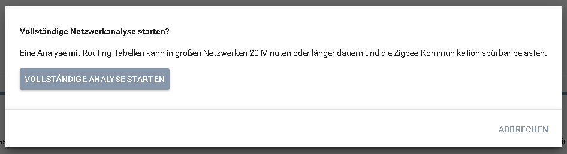
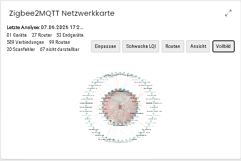
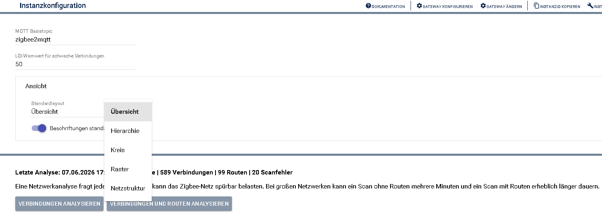
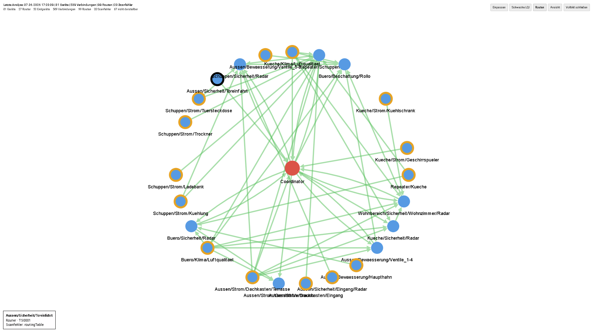

# Zigbee2MQTT Netzwerkkarte

Das Modul analysiert die Zigbee-Netzwerktopologie und stellt Geräte, Verbindungen, Routing-Tabellen und Scanfehler in IP-Symcon dar. Die letzte Analyse wird lokal gespeichert und als interaktive HTML-SDK-Kachel visualisiert.

## Einrichtung

1. Eine Instanz **Zigbee2MQTT Netzwerkkarte** anlegen.
2. Den gleichen MQTT-Parent wie bei der zugehörigen Zigbee2MQTT-Bridge auswählen.
3. Das MQTT-Basistopic der Zigbee2MQTT-Installation eintragen.
4. Optional den LQI-Warnwert und die Standardansicht einstellen.
5. Eine Netzwerkanalyse starten.

Der LQI-Warnwert legt fest, ab welchem Wert eine Verbindung in der Kachel als schwach gilt. Die Standardansicht bestimmt nur die anfängliche Darstellung beim Öffnen der Kachel; sie kann später innerhalb der Kachel jederzeit temporär umgeschaltet werden.

## Netzwerkanalyse

Zigbee2MQTT fragt während einer Netzwerkanalyse jeden erreichbaren Router nacheinander ab. Dadurch kann das Zigbee-Netz vorübergehend stärker belastet werden.

- **Verbindungen analysieren** fordert LQI- und Nachbarschaftsdaten ohne Routing-Tabellen an.
- **Verbindungen und Routen analysieren** liest zusätzlich die Routing-Tabellen der Router.

Beim Start von **Verbindungen und Routen analysieren** erscheint deshalb zunächst ein Bestätigungsdialog:

Die vollständige Analyse sollte nur gestartet werden, wenn die Routing-Tabellen tatsächlich für eine tiefergehende Diagnose benötigt werden. Sie fragt zusätzlich die Routing-Tabelle jedes erreichbaren Routers ab, kann dadurch deutlich länger dauern und die normale Zigbee-Kommunikation während des Scans spürbar belasten. In großen Netzwerken sind Laufzeiten von 20 Minuten oder länger möglich.

Mit **Vollständige Analyse starten** wird die Analyse verbindlich gestartet. **Abbrechen** schließt den Dialog, ohne eine Anfrage an Zigbee2MQTT zu senden. Für eine schnelle Prüfung der Geräte, Nachbarschaften und LQI-Werte genügt normalerweise **Verbindungen analysieren**.

Die Anfrage läuft vollständig asynchron. Die Symcon-Instanz wartet nicht blockierend auf die Antwort und zeigt währenddessen die verstrichene Zeit an. Bei großen Netzwerken kann die Analyse lange dauern. In einem Netzwerk mit ungefähr 100 Geräten und 69 Routern dauerte die Analyse ohne Routen etwa vier Minuten und mit Routen etwa 18 Minuten.

Während einer laufenden Analyse kann keine zweite Analyse gestartet werden. Falls Zigbee2MQTT keine Antwort mehr liefert, setzt **Scanstatus zurücksetzen** ausschließlich den lokalen Symcon-Status zurück.

## Diagnoseansichten

Die Konfiguration zeigt:

- Geräte mit Typ, Modell, Netzwerkadresse, IEEE-Adresse, `last_seen` und Scanstatus
- gerichtete Verbindungen mit LQI, Beziehung, Tiefe und Anzahl zugehöriger Routen
- Routing-Einträge mit Zieladresse, nächstem Hop und Status
- fehlgeschlagene LQI- oder Routing-Abfragen

LQI-Werte sind gerichtet und können für Hin- und Rückweg unterschiedlich sein. Ein niedriger LQI oder eine fehlende Verbindung ist ein Diagnosehinweis, aber nicht automatisch ein Gerätefehler.

## Visualisierung

Die HTML-SDK-Kachel bietet eine interaktive Darstellung der zuletzt gespeicherten Analyse:

- Coordinator, Router und Endgeräte werden unterschiedlich dargestellt.
- Schwache Verbindungen und Verbindungen mit aktiven Routen können hervorgehoben werden.
- Geräte lassen sich anklicken, verschieben, zoomen und gemeinsam in die Ansicht einpassen.
- Die Gerätesuche findet Knoten anhand von Name, Modell, Typ oder Adresse und kann ein einzelnes Gerät oder dessen direktes Netzwerkumfeld hervorheben.
- Beschriftungen lassen sich für eine ruhigere Darstellung großer Netze ausblenden.
- Die Kachel startet selbst keine Netzwerkanalyse.

Die Buttons der Kachel haben folgende Aufgaben:

| Button | Funktion |
|---|---|
| **Einpassen** | Zentriert die aktuell sichtbaren Geräte und Verbindungen und passt sie an die verfügbare Kachelfläche an. |
| **Schwache LQI** | Zeigt ausschließlich Verbindungen, deren LQI unterhalb des in der Instanz konfigurierten Warnwerts liegt. |
| **Routen** | Zeigt ausschließlich Verbindungen an, für die in der letzten Analyse Routing-Einträge vorhanden waren. Routing-Daten stehen nur nach einer Analyse mit Routen zur Verfügung. |
| **Ansicht** | Öffnet die Werkzeuge für Layoutwechsel, Gerätesuche, Umfeldfokus und das Ein- oder Ausblenden der Beschriftungen. |
| **Vollbild** | Öffnet die interaktive Netzwerkkarte bildschirmfüllend. Der Vollbildmodus kann über denselben Button oder `Esc` geschlossen werden und verwendet automatisch eine zum aktiven Symcon-Profil passende kontrastierende Fläche. |

Im Abschnitt **Ansicht** der Instanzkonfiguration werden das beim Öffnen verwendete Standardlayout und die anfängliche Sichtbarkeit der Beschriftungen festgelegt. Änderungen über den Button **Ansicht** innerhalb der Kachel gelten nur für die aktuell geöffnete Darstellung und verändern diese gespeicherten Vorgaben nicht.

Die verfügbaren Layouts sind:

| Layout | Zweck |
|---|---|
| **Übersicht** | Ordnet Coordinator, Router und Endgeräte ringförmig an und ist für große Netze meist der beste Einstieg. |
| **Hierarchie** | Stellt das Netz stärker als Ebenenstruktur dar. Das kann bei kleineren Netzen oder Routing-Analysen hilfreich sein. |
| **Kreis** | Verteilt alle sichtbaren Geräte gleichmäßig auf einem Kreis. |
| **Raster** | Legt die Geräte in einem gleichmäßigen Raster ab und ist vor allem für sehr dichte Ansichten nützlich. |
| **Netzstruktur** | Lässt Cytoscape.js die Knoten anhand der Verbindungen frei anordnen. Das kann aussagekräftig sein, braucht bei großen Netzen aber mehr Platz. |

Über **Gerät suchen** kann ein Gerät anhand von Name, Modell, Typ, IEEE-Adresse oder Netzwerkadresse gefunden werden. **Umfeld** blendet anschließend nur das ausgewählte Gerät und seine direkten Nachbarn ein. **Alle anzeigen** hebt die Einschränkung wieder auf.

### Warum gibt es einen eigenen Vollbildmodus?

Der Button **Vollbild** ist aufgrund einer Einschränkung von IP-Symcon erforderlich. Der reguläre Vergrößerungspfeil einer individuellen HTML-SDK-Kachel öffnet lediglich die normale Detailansicht der Instanz. Das PHP-SDK von Symcon bietet derzeit keine Möglichkeit, für diese maximierte Detailansicht eine eigene HTML-Darstellung bereitzustellen.

Da die Netzwerkkarten-Instanz keine darzustellenden Kindobjekte benötigt, bleibt die von Symcon geöffnete Detailansicht leer. Für eine große, weiterhin interaktive Darstellung stellt das Modul deshalb den eigenen Button **Vollbild** innerhalb der Netzwerkkarte bereit.

### Routing-Ansicht

Der Button **Routen** reduziert die Darstellung auf Verbindungen, denen Zigbee2MQTT während der letzten Analyse mindestens einen Routing-Eintrag zuordnen konnte. Diese Ansicht steht deshalb nur sinnvoll zur Verfügung, wenn zuvor **Verbindungen und Routen analysieren** ausgeführt wurde.

Die Darstellung verwendet folgende Markierungen:

| Element | Bedeutung |
|---|---|
| Roter Knoten | Coordinator des Zigbee-Netzwerks |
| Blauer Knoten | Router |
| Türkiser Knoten | Endgerät |
| Grüner Pfeil | Gerichtete Verbindung, für die mindestens ein Routing-Eintrag vorliegt |
| Orangefarbener Rand | Bei diesem Gerät ist während der letzten Analyse mindestens eine Abfrage fehlgeschlagen |
| Kontrastreicher dunkler oder heller Rand | Aktuell ausgewähltes Gerät |

Die Pfeilrichtung entspricht der in den von Zigbee2MQTT gelieferten Topologiedaten enthaltenen Richtung von Quelle zu Ziel. Die Routing-Ansicht ist eine Diagnosehilfe und keine garantierte Echtzeitdarstellung des Weges jedes einzelnen Zigbee-Pakets. Routing-Tabellen können sich ändern und einzelne Abfragen können unvollständig bleiben.

Nach einem Klick auf ein Gerät erscheint unten links eine Detailkarte. Sie zeigt:

- den Anzeigenamen beziehungsweise die IEEE-Adresse des Geräts,
- den Gerätetyp, beispielsweise `Router`, sowie das Modell, sofern bekannt,
- fehlgeschlagene Abfragen der letzten Analyse.

Der Hinweis `Scanfehler: routingTable` bedeutet, dass Zigbee2MQTT die Routing-Tabelle dieses Routers während der letzten Analyse nicht erfolgreich lesen konnte. Das Gerät ist dadurch nicht automatisch offline oder defekt. Mögliche Ursachen sind beispielsweise eine Zeitüberschreitung, eine vorübergehend gestörte Kommunikation oder eine vom Gerät nicht beantwortete Routing-Abfrage. Ein erneuter Scan kann deshalb ein anderes Ergebnis liefern.

Ein Klick auf eine freie Stelle der Netzwerkkarte schließt die Detailkarte wieder.

Für die lokale Graphdarstellung wird [Cytoscape.js](https://js.cytoscape.org/) unter MIT-Lizenz mitgeliefert. Der vollständige Lizenztext liegt unter `NetworkMap/assets/CYTOSCAPE-LICENSE.txt`. Es werden keine externen Webressourcen nachgeladen.

## Exporte

Aus der gespeicherten RAW-Analyse erzeugt Symcon lokal:

- JSON-Rohdaten
- Graphviz-DOT
- PlantUML

Die Exporte starten keinen zusätzlichen Netzwerkscan. Wegen der Größe vollständiger Netzwerkanalysen werden die Dateien nicht über den begrenzten Symcon-Ausgabepuffer heruntergeladen, sondern unter `user/IPSZigbee2MQTT/networkmaps` auf dem Symcon-Server gespeichert.

Die erzeugten Dateien enthalten einen Zeitstempel im Dateinamen. JSON eignet sich zur späteren technischen Analyse, Graphviz-DOT und PlantUML können in passenden externen Werkzeugen weiter visualisiert oder dokumentiert werden.

## Skriptfunktionen

| Funktion | Beschreibung |
|---|---|
| `Z2M_StartNetworkScan(InstanceID, IncludeRoutes)` | Startet eine asynchrone RAW-Netzwerkanalyse. Mit `IncludeRoutes = true` werden zusätzlich Routing-Tabellen abgefragt. |
| `Z2M_ResetNetworkScanStatus(InstanceID)` | Setzt ausschließlich den lokalen Status einer vermeintlich hängen gebliebenen Analyse zurück. |
| `Z2M_ExportNetworkMapRaw(InstanceID)` | Gibt die zuletzt gespeicherte RAW-Topologie als JSON zurück. |
| `Z2M_ExportNetworkMapGraphviz(InstanceID)` | Erzeugt aus der gespeicherten Topologie eine Graphviz-DOT-Darstellung. |
| `Z2M_ExportNetworkMapPlantUML(InstanceID)` | Erzeugt aus der gespeicherten Topologie eine PlantUML-Darstellung. |
| `Z2M_CreateNetworkMapExportFiles(InstanceID)` | Speichert RAW-, Graphviz- und PlantUML-Dateien unter `user/IPSZigbee2MQTT/networkmaps`. |

Nur `Z2M_StartNetworkScan()` fordert neue Daten von Zigbee2MQTT an. Alle Exportfunktionen arbeiten lokal mit der zuletzt vollständig empfangenen Analyse.
